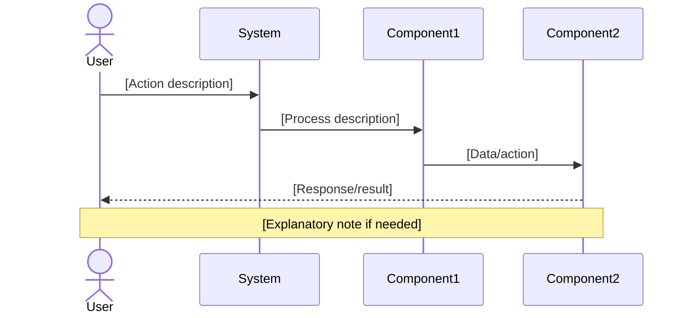
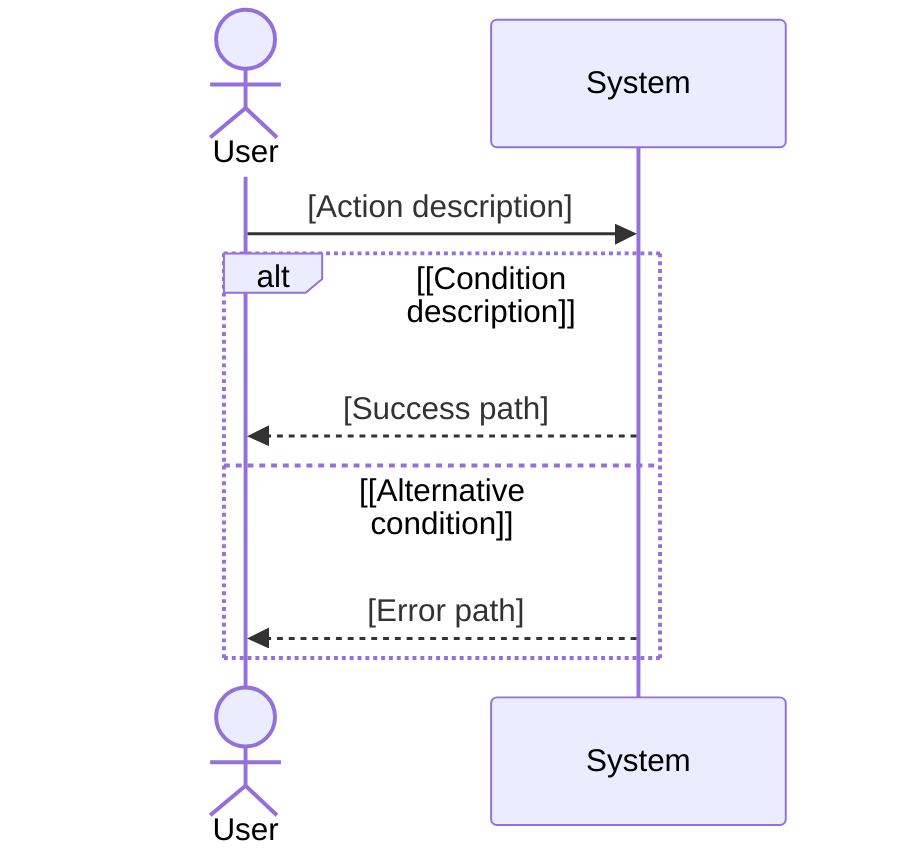

# Feature Specification: [FEATURE NAME]

**Feature Branch**: `[###-feature-name]`
**Created**: [DATE]
**Status**: Draft
**Input**: User description: "$ARGUMENTS"

## Root Cause Analysis *(mandatory)*

<!--
  CONSTITUTION REQUIREMENT (Principle VI): All feature specifications MUST include root cause analysis.

  Before proposing solutions, understand the actual problem. This section should:
  - Clearly document the problem symptoms (what users are experiencing)
  - Identify the root causes (why the problem exists)
  - Distinguish between symptoms and underlying causes
  - Research existing solutions and analyze why they may not work
  - Validate assumptions through data or user research when available
-->

### Problem Statement

[Describe the problem in clear, observable terms. What are users experiencing? What isn't working?]

### Symptoms vs Root Causes

**Observed Symptoms**:
- [Symptom 1: What users see or experience]
- [Symptom 2: Another observable issue]
- [Symptom 3: Related problems]

**Root Cause Analysis**:

Using systematic analysis (5 Whys, fishbone, etc.), identify the underlying causes:

1. **Why does [symptom] occur?**
   - [First level cause]

2. **Why does [first level cause] happen?**
   - [Second level cause]

3. **Why does [second level cause] exist?**
   - [Root cause - the actual problem to solve]

**Identified Root Causes**:
- **RC-1**: [Primary root cause with explanation]
- **RC-2**: [Secondary root cause if multiple exist]

### Existing Solutions Analysis

<!--
  Research what solutions currently exist (workarounds, competitors, prior attempts)
  and why they don't adequately address the root causes.
-->

| Solution/Approach | What It Addresses | Why It's Insufficient |
|-------------------|-------------------|----------------------|
| [Current workaround] | [Symptoms it helps] | [Why it doesn't solve root cause] |
| [Competitor solution] | [What they solve] | [Gaps or limitations] |
| [Prior attempt] | [What was tried] | [Why it failed or was incomplete] |

### Validated Assumptions

<!--
  Document key assumptions and how they were validated (if possible).
  Mark unvalidated assumptions clearly for later research.
-->

- **Assumption 1**: [Statement]
  - Validation: [How verified, or mark "NEEDS VALIDATION"]
- **Assumption 2**: [Statement]
  - Validation: [Evidence or data source]

### Solution Requirements

Based on the root cause analysis, solutions MUST:
- Address root cause RC-1: [How solution targets this cause]
- Address root cause RC-2: [How solution targets this cause]
- NOT just treat symptoms: [Explain how solution goes beyond surface fixes]

## User Scenarios & Testing *(mandatory)*

<!--
  IMPORTANT: User stories should be PRIORITIZED as user journeys ordered by importance.
  Each user story/journey must be INDEPENDENTLY TESTABLE - meaning if you implement just ONE of them,
  you should still have a viable MVP (Minimum Viable Product) that delivers value.
  
  Assign priorities (P1, P2, P3, etc.) to each story, where P1 is the most critical.
  Think of each story as a standalone slice of functionality that can be:
  - Developed independently
  - Tested independently
  - Deployed independently
  - Demonstrated to users independently
-->

### User Story 1 - [Brief Title] (Priority: P1)

[Describe this user journey in plain language]

**Why this priority**: [Explain the value and why it has this priority level]

**Independent Test**: [Describe how this can be tested independently - e.g., "Can be fully tested by [specific action] and delivers [specific value]"]

**Acceptance Scenarios**:

1. **Given** [initial state], **When** [action], **Then** [expected outcome]
2. **Given** [initial state], **When** [action], **Then** [expected outcome]

---

### User Story 2 - [Brief Title] (Priority: P2)

[Describe this user journey in plain language]

**Why this priority**: [Explain the value and why it has this priority level]

**Independent Test**: [Describe how this can be tested independently]

**Acceptance Scenarios**:

1. **Given** [initial state], **When** [action], **Then** [expected outcome]

---

### User Story 3 - [Brief Title] (Priority: P3)

[Describe this user journey in plain language]

**Why this priority**: [Explain the value and why it has this priority level]

**Independent Test**: [Describe how this can be tested independently]

**Acceptance Scenarios**:

1. **Given** [initial state], **When** [action], **Then** [expected outcome]

---

[Add more user stories as needed, each with an assigned priority]

### Edge Cases

<!--
  ACTION REQUIRED: The content in this section represents placeholders.
  Fill them out with the right edge cases.
-->

- What happens when [boundary condition]?
- How does system handle [error scenario]?

## High-Level Sequence Diagrams *(mandatory)*

<!--
  CONSTITUTION REQUIREMENT (Principle II): All specifications MUST include high-level sequence diagrams.

  These diagrams should show:
  - User interactions with the system
  - Major system components and their interactions
  - Data flow at a conceptual level (not implementation details)
  - Key decision points and alternate flows

  Use Mermaid sequenceDiagram syntax for consistency and renderability.
  Create one diagram per user story or combine related stories if the flow is cohesive.
-->

### User Story 1 Flow

### User Story 2 Flow

[Add more sequence diagrams as needed for each user story or complex flow]

## Requirements *(mandatory)*

<!--
  ACTION REQUIRED: The content in this section represents placeholders.
  Fill them out with the right functional requirements.
-->

### Functional Requirements

- **FR-001**: System MUST [specific capability, e.g., "allow users to create accounts"]
- **FR-002**: System MUST [specific capability, e.g., "validate email addresses"]  
- **FR-003**: Users MUST be able to [key interaction, e.g., "reset their password"]
- **FR-004**: System MUST [data requirement, e.g., "persist user preferences"]
- **FR-005**: System MUST [behavior, e.g., "log all security events"]

*Example of marking unclear requirements:*

- **FR-006**: System MUST authenticate users via [NEEDS CLARIFICATION: auth method not specified - email/password, SSO, OAuth?]
- **FR-007**: System MUST retain user data for [NEEDS CLARIFICATION: retention period not specified]

### Key Entities *(include if feature involves data)*

- **[Entity 1]**: [What it represents, key attributes without implementation]
- **[Entity 2]**: [What it represents, relationships to other entities]

## Success Criteria *(mandatory)*

<!--
  ACTION REQUIRED: Define measurable success criteria.
  These must be technology-agnostic and measurable.
-->

### Measurable Outcomes

- **SC-001**: [Measurable metric, e.g., "Users can complete account creation in under 2 minutes"]
- **SC-002**: [Measurable metric, e.g., "System handles 1000 concurrent users without degradation"]
- **SC-003**: [User satisfaction metric, e.g., "90% of users successfully complete primary task on first attempt"]
- **SC-004**: [Business metric, e.g., "Reduce support tickets related to [X] by 50%"]
