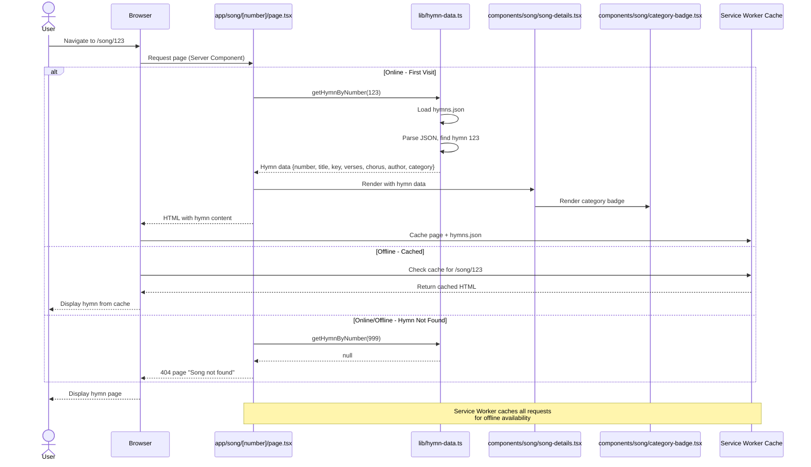
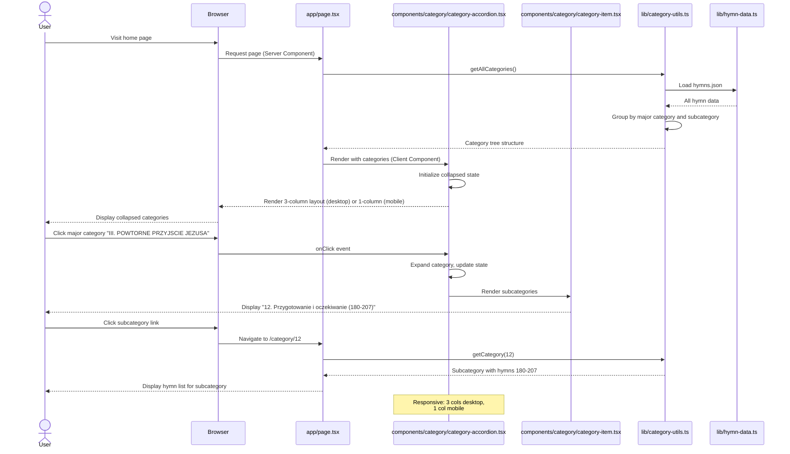
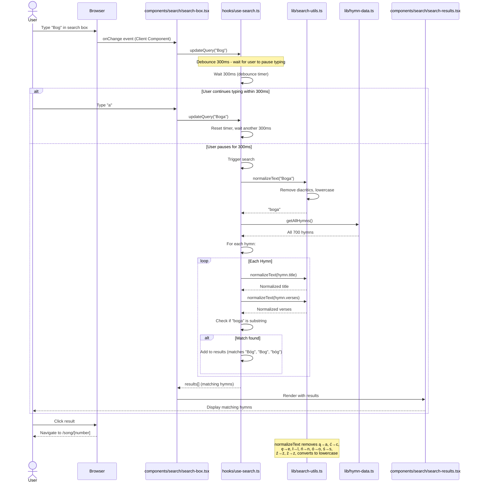
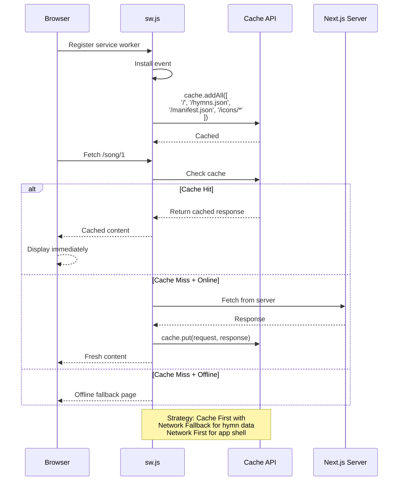
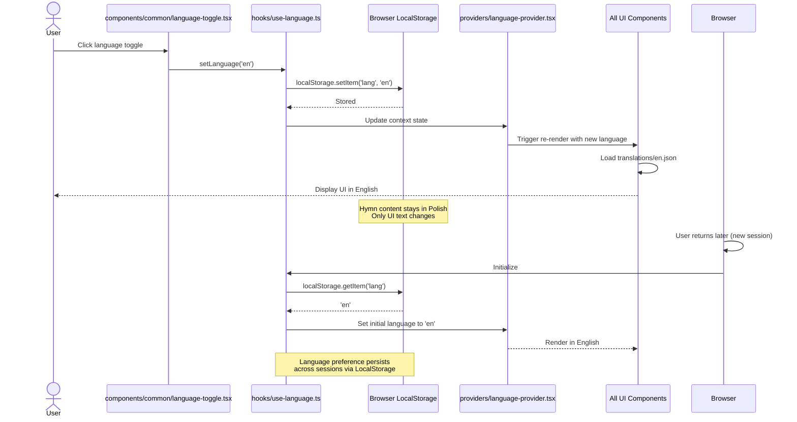
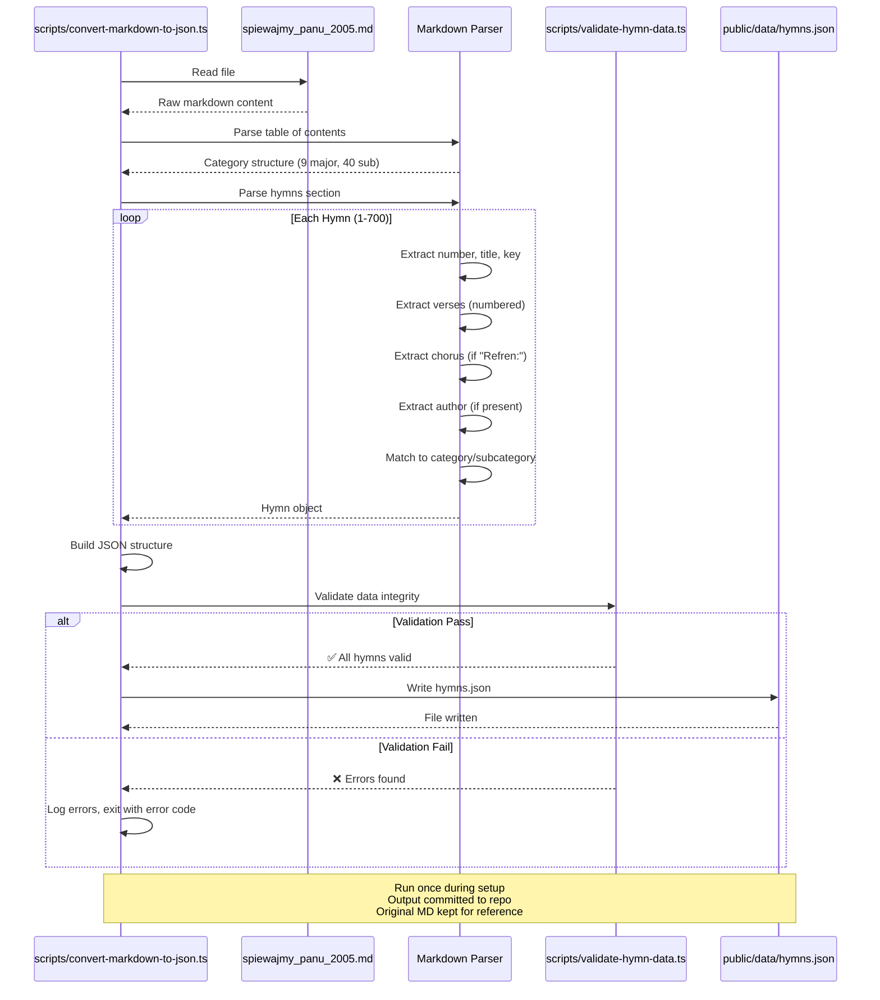

# Implementation Plan: Polish SDA Hymnal Songbook Application

**Branch**: `001-polish-songbook-app` | **Date**: 2026-02-15 | **Spec**: [spec.md](./spec.md)
**Input**: Feature specification from `/specs/001-polish-songbook-app/spec.md`

## Summary

Digital hymnal web application for the Polish SDA church community providing access to 700 hymns with search, categorization, and offline capabilities. The application will import hymnal content from markdown, convert to JSON, and present through a Next.js Progressive Web App with bilingual interface (Polish/English), diacritic-insensitive search, and responsive category browsing.

**Technical Approach**: Next.js 16+ App Router with TypeScript, deployed as PWA with service worker caching, static hymn data in JSON format, client-side search with normalized text comparison, Tailwind CSS for responsive UI, pnpm workspace monorepo structure.

## Technical Context

**Language/Version**: TypeScript 5+ with strict mode enabled
**Framework**: Next.js 16+ with App Router (React 19+)
**Primary Dependencies**:
- Next.js 16+ (App Router, PWA support)
- React 19+
- Tailwind CSS 4+ (styling)
- next-pwa (Progressive Web App functionality)
- Service Worker (offline caching)

**Storage**: Static JSON files (hymn data at build time), browser LocalStorage (language preference), Service Worker Cache API (offline data)
**Testing**: Not required for initial MVP (per spec - no test requirements specified)
**Target Platform**: Web browsers (desktop and mobile), PWA-capable browsers (Chrome, Safari, Firefox, Edge)
**Project Type**: Web application (Next.js monorepo)
**Performance Goals**:
- Hymn page load: <3 seconds (SC-001)
- Search results: <2 seconds (SC-002)
- Offline hymn load: <1 second (SC-008)

**Constraints**:
- Offline-capable (PWA with caching) - SC-009
- Mobile-optimized (primary use case during services) - SC-005
- Polish character support (UTF-8, diacritic-insensitive search) - SC-006, FR-008
- 700 hymns with complete metadata - SC-003

**Scale/Scope**:
- 700 hymns total
- 9 major categories, 40 subcategories
- ~10KB per hymn average (text only)
- Total data: ~7MB hymn content
- Expected concurrent users: <1000 (single church community)

## Constitution Check

*GATE: Must pass before Phase 0 research. Re-check after Phase 1 design.*

### Principle I: Type Safety First
- ✅ **Pass**: TypeScript 5+ with strict mode
- ✅ **Pass**: No `any` type usage
- ✅ **Pass**: Explicit return types for all functions
- ✅ **Pass**: Prefer `type` over `interface`

### Principle II: Visual Documentation
- ✅ **Pass**: High-level sequence diagrams in spec.md
- ✅ **Pass**: Detailed sequence diagrams in this plan (see below)

### Principle III: Phased Development
- ✅ **Pass**: Following phased commit strategy
- ✅ **Pass**: Commit after specification (completed)
- ✅ **Pass**: Commit after planning (this phase)
- ✅ **Pass**: Will commit after tasks, then implementation

### Principle IV: Component Separation
- ✅ **Pass**: Presentational components in `packages/web/components/`
- ✅ **Pass**: Business logic in pages, hooks, providers
- ✅ **Pass**: One component per file with exported prop types

### Principle V: Conventional Commits
- ✅ **Pass**: Using feature branch `001-polish-songbook-app`
- ✅ **Pass**: All commits follow conventional format

### Principle VI: Root Cause Analysis
- ✅ **Pass**: Spec includes comprehensive root cause analysis

### Technology Constraints
- ✅ **Pass**: Next.js 16+ with App Router
- ✅ **Pass**: TypeScript 5+ with strict mode
- ✅ **Pass**: React 19+
- ✅ **Pass**: Tailwind CSS 4+
- ✅ **Pass**: pnpm 10+ (will configure)
- ✅ **Pass**: Monorepo structure with pnpm workspaces (will create)

**Gate Status**: ✅ **ALL GATES PASSED** - Ready to proceed to Phase 0

## Project Structure

### Documentation (this feature)

```text
specs/001-polish-songbook-app/
├── spec.md                   # Feature specification (completed)
├── plan.md                   # This file (in progress)
├── research.md               # Phase 0 output (to be created)
├── data-model.md             # Phase 1 output (to be created)
├── quickstart.md             # Phase 1 output (to be created)
├── contracts/                # Phase 1 output (to be created)
│   └── hymn-data-schema.json # JSON schema for hymn data
├── checklists/
│   └── requirements.md       # Quality checklist (completed)
└── tasks.md                  # Phase 2 output (created by /speckit.tasks)
```

### Source Code (repository root)

Following constitutional monorepo structure with pnpm workspaces:

```text
packages/
├── web/                           # Main Next.js web application
│   ├── app/                       # Next.js App Router
│   │   ├── page.tsx              # Home page (search + category list)
│   │   ├── layout.tsx            # Root layout (language provider)
│   │   ├── song/
│   │   │   └── [number]/
│   │   │       └── page.tsx      # Individual hymn page
│   │   └── category/
│   │       └── [id]/
│   │           └── page.tsx      # Category listing page
│   │
│   ├── components/                # Presentational UI components
│   │   ├── layout/
│   │   │   ├── header.tsx        # App header with language toggle
│   │   │   └── footer.tsx        # App footer
│   │   ├── song/
│   │   │   ├── song-card.tsx     # Hymn preview card
│   │   │   ├── song-details.tsx  # Full hymn display
│   │   │   ├── verse-display.tsx # Verse formatting component
│   │   │   └── category-badge.tsx # Category/subcategory badge
│   │   ├── search/
│   │   │   ├── search-box.tsx    # Search input with debounce
│   │   │   └── search-results.tsx # Search results list
│   │   ├── category/
│   │   │   ├── category-accordion.tsx # Expandable category list
│   │   │   └── category-item.tsx      # Single category/subcategory
│   │   └── common/
│   │       ├── language-toggle.tsx    # Polish/English switcher
│   │       └── offline-indicator.tsx  # Online/offline status
│   │
│   ├── hooks/                     # Custom React hooks
│   │   ├── use-hymns.ts          # Hymn data access
│   │   ├── use-search.ts         # Debounced search with normalization
│   │   ├── use-language.ts       # Language preference management
│   │   └── use-offline.ts        # Offline status detection
│   │
│   ├── lib/                       # Utility functions
│   │   ├── hymn-data.ts          # Load and parse JSON hymn data
│   │   ├── search-utils.ts       # Text normalization, diacritic removal
│   │   ├── category-utils.ts     # Category grouping logic
│   │   └── pwa-utils.ts          # Service worker registration
│   │
│   ├── providers/
│   │   └── language-provider.tsx # I18n context provider
│   │
│   ├── public/
│   │   ├── data/
│   │   │   └── hymns.json        # All 700 hymns (generated from MD)
│   │   ├── manifest.json         # PWA manifest
│   │   ├── sw.js                 # Service worker (generated)
│   │   └── icons/                # PWA icons
│   │
│   ├── styles/
│   │   └── globals.css           # Tailwind imports
│   │
│   ├── translations/
│   │   ├── pl.json               # Polish UI text
│   │   └── en.json               # English UI text
│   │
│   ├── package.json              # Web package dependencies
│   ├── tsconfig.json             # TypeScript config (strict mode)
│   ├── tailwind.config.ts        # Tailwind configuration
│   └── next.config.js            # Next.js config (PWA setup)
│
├── shared/                        # Shared code across packages
│   ├── types/
│   │   ├── hymn.ts               # Hymn type definition
│   │   ├── category.ts           # Category type definition
│   │   └── index.ts              # Barrel exports
│   │
│   ├── utils/
│   │   └── text-normalize.ts    # Diacritic removal utility
│   │
│   └── package.json              # Shared package definition
│
└── scripts/                       # Build/maintenance scripts
    ├── convert-markdown-to-json.ts # Parse MD → JSON
    └── validate-hymn-data.ts       # Data integrity checks

pnpm-workspace.yaml                # pnpm workspace configuration
package.json                        # Root package.json
tsconfig.json                       # Root TypeScript config
.gitignore
README.md
```

**Structure Decision**: Monorepo with pnpm workspaces as required by constitution. Main application in `packages/web/` using Next.js App Router. Shared types in `packages/shared/` for future extensibility (e.g., mobile app, API service). Hymn data as static JSON in `public/data/` for build-time optimization and offline caching.

## Detailed Sequence Diagrams *(mandatory)*

### User Story 1: View Hymn by Number Implementation Flow



### User Story 2: Browse Categories Implementation Flow



### User Story 3: Search Hymns Implementation Flow



### PWA Offline Caching Flow



### Language Toggle Implementation Flow



### Markdown to JSON Conversion (Build-time)



## Complexity Tracking

*No constitutional violations - all gates passed. No complexity justification needed.*

---

**Next Steps**: Proceed to Phase 0 (Research) to resolve any remaining technical decisions and create detailed research documentation.
