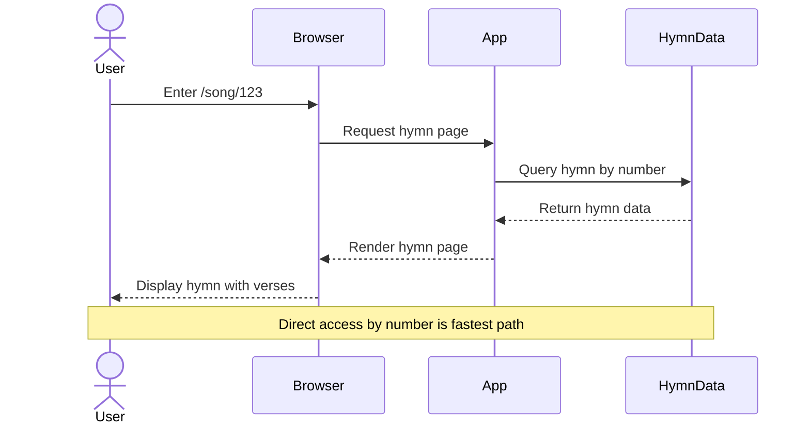
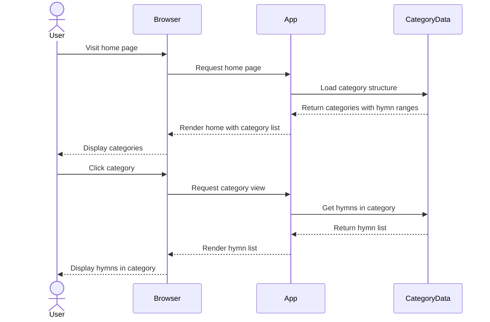
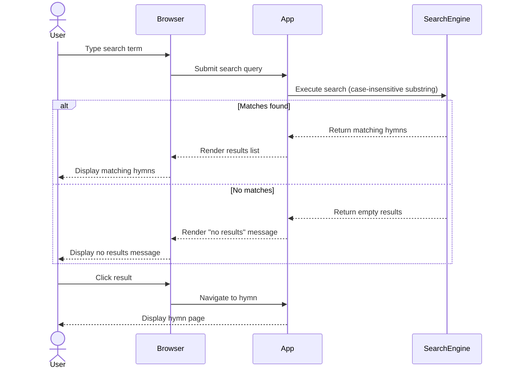

# Feature Specification: Polish SDA Hymnal Songbook Application

**Feature Branch**: `001-polish-songbook-app`
**Created**: 2026-02-15
**Status**: Draft
**Input**: User description: "We are going to create a next.js application. This will be a song book application for the polish version of the SDA hymnal. There is a markdown file at /Users/stefanrusek/Downloads/spiewajmy_panu_2005.md this file will be imported and read into json. The table of contents in the document also includes a categorization scheme and groupings by number. The app will have a search box on the home pages, as well as a list of groupings. The search will search by number and by title and by song contents. for now a single case insenstive sub string search is fine. later we might add an index or something. /song/:number should load an individual song. Each song has a key, a title, sometimes an author or tranlator, verses, and sometimes a chorus (in pl refren)."

## Root Cause Analysis *(mandatory)*

### Problem Statement

Members of the Polish SDA church community need convenient access to hymnal content during worship services, personal devotions, and group gatherings. Currently, accessing hymns requires physical songbooks, which may not always be available, portable, or convenient to use. Users need a way to quickly find specific hymns by number, title, or content, and view them in a clear, readable format on their devices.

### Symptoms vs Root Causes

**Observed Symptoms**:
- Users carry physical songbooks to services and events
- Difficulty finding specific hymns quickly during services
- Limited portability - physical books are heavy and bulky
- No ability to search hymn content or lyrics
- Sharing hymn references with others requires verbal communication of numbers

**Root Cause Analysis**:

Using systematic analysis (5 Whys), identify the underlying causes:

1. **Why do users struggle to access hymns conveniently?**
   - Physical songbooks are the only available format

2. **Why are physical songbooks limiting?**
   - They require manual page flipping and lack search functionality
   - They are not always available or portable

3. **Why hasn't a digital solution been provided?**
   - The hymnal content exists only in physical format and needs to be digitized and made accessible through a modern web interface

**Identified Root Causes**:
- **RC-1**: No digital version of the Polish SDA hymnal exists for convenient access
- **RC-2**: Hymnal content is not structured in a searchable, navigable digital format

### Existing Solutions Analysis

| Solution/Approach     | What It Addresses              | Why It's Insufficient                                                      |
| --------------------- | ------------------------------ | -------------------------------------------------------------------------- |
| Physical songbooks    | Provides complete hymnal content | Not portable, no search capability, requires manual navigation           |
| PDF versions          | Digital format for distribution  | Not optimized for mobile viewing, no search functionality, difficult navigation |
| Generic songbook apps | Digital hymn access              | Don't contain Polish SDA specific content and categorization             |

### Validated Assumptions

- **Assumption 1**: The markdown file at /Users/stefanrusek/Downloads/spiewajmy_panu_2005.md contains complete and accurate hymnal content
  - Validation: File exists and contains structured hymn data with table of contents, categories, and complete song texts

- **Assumption 2**: Users will access the application primarily on mobile devices during services
  - Validation: NEEDS VALIDATION - Common pattern for digital songbooks, but specific usage patterns should be monitored after launch

- **Assumption 3**: Case-insensitive substring search will provide adequate search functionality initially
  - Validation: Standard pattern for initial MVPs; can be enhanced with full-text indexing based on user feedback

### Solution Requirements

Based on the root cause analysis, solutions MUST:
- Address root cause RC-1: Create a web-based digital hymnal accessible from any device
- Address root cause RC-2: Structure hymnal content as searchable JSON data with proper indexing
- NOT just treat symptoms: Go beyond simple digitization by providing search, categorization, and instant navigation capabilities

## User Scenarios & Testing *(mandatory)*

### User Story 1 - View Individual Hymn by Number (Priority: P1)

A church member knows the hymn number being announced and needs to quickly view that specific hymn on their device during a worship service.

**Why this priority**: Core functionality that delivers immediate value - users need to access specific hymns by number, which is how they're referenced during services.

**Independent Test**: Can be fully tested by entering a URL with a song number (/song/1) and verifying the complete song displays with title, verses, and optional chorus/author information.

**Acceptance Scenarios**:

1. **Given** a user navigates to /song/1, **When** the page loads, **Then** the hymn displays with number, title, key signature, verses, and any chorus or author information
2. **Given** a user navigates to /song/250, **When** the page loads, **Then** the specific hymn #250 displays correctly
3. **Given** a user navigates to /song/999 (invalid number), **When** the page loads, **Then** an appropriate "song not found" message displays

---

### User Story 2 - Browse Hymns by Category (Priority: P2)

A worship leader or church member wants to find hymns suitable for a specific purpose (e.g., "Advent", "Baptism", "Morning/Evening") by browsing organized categories.

**Why this priority**: Enables discovery and planning - users can find appropriate hymns for different service types and occasions without knowing specific numbers.

**Independent Test**: Can be tested by navigating to the home page, viewing the category list matching the table of contents structure, and selecting a category to see all hymns in that grouping.

**Acceptance Scenarios**:

1. **Given** a user visits the home page, **When** the page loads, **Then** a list of all major categories (I-IX) and subcategories (1-40) displays
2. **Given** a user clicks on a category, **When** the category opens, **Then** all hymn numbers and titles within that grouping display
3. **Given** a user clicks on a hymn from the category list, **When** the hymn link is clicked, **Then** the user navigates to that specific hymn page

---

### User Story 3 - Search Hymns by Title or Content (Priority: P3)

A church member remembers part of a hymn's title or some lyrics but doesn't know the number, and needs to find it quickly.

**Why this priority**: Enhances usability - allows finding hymns when the number is unknown, but is less critical than direct number access during services.

**Independent Test**: Can be tested by entering search terms (partial titles, lyrics) in the search box and verifying matching results display with hymn numbers, titles, and match context.

**Acceptance Scenarios**:

1. **Given** a user types "Jezu" in the search box, **When** the search executes, **Then** all hymns with "jezu" in title or lyrics display (case-insensitive)
2. **Given** a user types "123" in the search box, **When** the search executes, **Then** hymn #123 appears in results
3. **Given** a user types text with no matches, **When** the search executes, **Then** a "no results found" message displays
4. **Given** search results are displayed, **When** a user clicks on a result, **Then** the user navigates to that hymn page

---

### Edge Cases

- What happens when a user enters a non-numeric song number (e.g., /song/abc)?
- What happens when the markdown file cannot be parsed during import?
- What happens when a user searches with very common Polish words that appear in many hymns?
- How does the system handle hymns with no author or chorus information?
- What happens on slow network connections - is there loading feedback?
- How are Polish characters (ą, ć, ę, ł, ń, ó, ś, ź, ż) handled in search?

## High-Level Sequence Diagrams *(mandatory)*

### User Story 1 Flow - View Hymn by Number

### User Story 2 Flow - Browse Categories

### User Story 3 Flow - Search Hymns

## Requirements *(mandatory)*

### Functional Requirements

- **FR-001**: System MUST import hymnal content from the markdown file and convert it to structured JSON format
- **FR-002**: System MUST parse hymn numbers, titles, key signatures, verses, choruses (refren), and author/translator information from the markdown
- **FR-003**: System MUST parse and store the table of contents structure with all 9 major categories and 40 subcategories with their number ranges
- **FR-004**: System MUST provide a route /song/:number that displays an individual hymn by its number
- **FR-005**: System MUST display all hymn information including number, title, key, verses, chorus (if present), and author (if present)
- **FR-006**: Home page MUST display a search box prominently
- **FR-007**: Home page MUST display a list of all categories and subcategories from the table of contents
- **FR-008**: System MUST perform case-insensitive substring search across hymn numbers, titles, and lyrics
- **FR-009**: Search results MUST display matching hymns with their numbers and titles
- **FR-010**: Users MUST be able to navigate from search results or category listings to individual hymn pages
- **FR-011**: System MUST handle invalid song numbers gracefully with appropriate error messages
- **FR-012**: System MUST preserve Polish characters correctly in all display and search operations

### Key Entities

- **Hymn**: Represents an individual song with attributes:
  - Number (1-700)
  - Title
  - Key signature (musical key like "F", "Es", "G", "D")
  - Verses (numbered list of verse texts)
  - Chorus/Refren (optional repeated section)
  - Author/Translator (optional attribution)
  - Full text content (for search)

- **Category**: Represents a grouping from the table of contents with attributes:
  - Major category (I-IX, e.g., "NABOZENSTWO", "ZYCIE I DZIALALNOSC JEZUSA")
  - Subcategory number (1-40)
  - Subcategory name (e.g., "Uwielbienie Boga i dziekczynienie")
  - Hymn number range (start-end, e.g., 1-61)
  - List of hymn numbers included in this category

- **Search Result**: Represents a match from search query with attributes:
  - Hymn number
  - Hymn title
  - Match context (where the search term was found)

## Success Criteria *(mandatory)*

### Measurable Outcomes

- **SC-001**: Users can access any hymn by number within 3 seconds of entering the URL
- **SC-002**: Search returns results within 2 seconds for any query
- **SC-003**: All 700 hymns from the source markdown file are successfully imported and accessible
- **SC-004**: 95% of users can find and view a specific hymn within 30 seconds using either direct navigation, category browsing, or search
- **SC-005**: Application displays correctly on mobile devices (phones and tablets) as well as desktop browsers
- **SC-006**: Polish characters display correctly in all contexts without encoding issues
- **SC-007**: Users successfully complete their primary task (viewing a hymn) on first attempt 90% of the time
