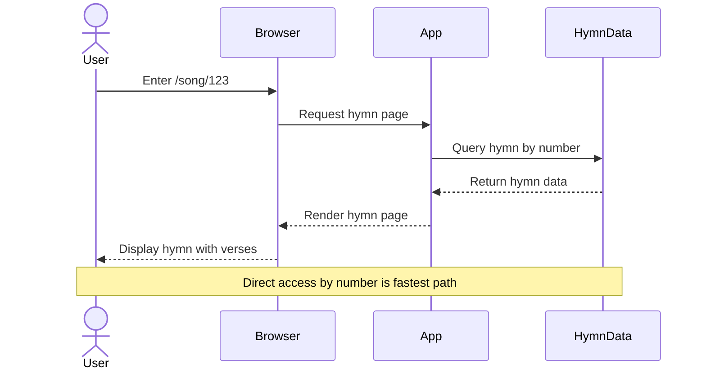
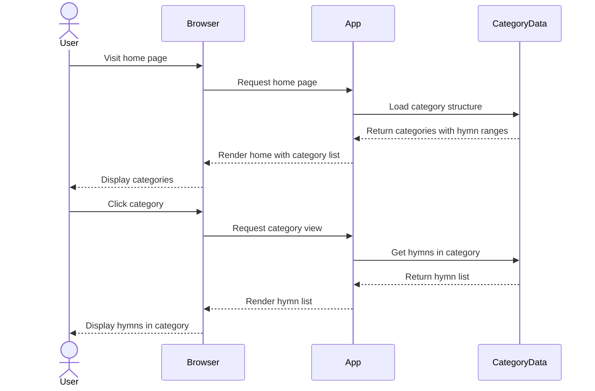
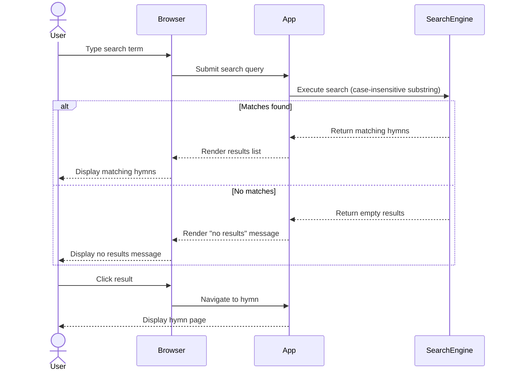

# Feature Specification: Polish SDA Hymnal Songbook Application

**Feature Branch**: `001-polish-songbook-app`
**Created**: 2026-02-15
**Status**: Draft
**Input**: User description: "We are going to create a next.js application. This will be a song book application for the polish version of the SDA hymnal. There is a markdown file at /Users/stefanrusek/Downloads/spiewajmy_panu_2005.md this file will be imported and read into json. The table of contents in the document also includes a categorization scheme and groupings by number. The app will have a search box on the home pages, as well as a list of groupings. The search will search by number and by title and by song contents. for now a single case insenstive sub string search is fine. later we might add an index or something. /song/:number should load an individual song. Each song has a key, a title, sometimes an author or tranlator, verses, and sometimes a chorus (in pl refren)."

## Clarifications

### Session 2026-02-15

- Q: Should search ignore diacritical marks in addition to case? → A: Yes, search must ignore diacritical marks (e.g., "o" matches "ó", "a" matches "ą")
- Q: How should hymn data be stored for runtime use? → A: Create JSON data file during implementation; keep original markdown file for future reference and re-import
- Q: What language should the user interface text be in? → A: Bilingual - Support both Polish and English with language toggle
- Q: When should search execute as the user types? → A: Debounced real-time - Search executes after user pauses typing (e.g., 300ms delay)
- Q: Should the application work offline? → A: Basic offline (PWA) - Cache hymn data for offline viewing after first visit
- Q: How should categories be displayed on the home page? → A: Expandable/collapsible accordion with responsive layout: three columns on desktop, one column on mobile
- Q: Should hymns include category information for navigation? → A: Yes, each hymn must include its major category and subcategory references to enable navigation to other hymns in the same category/subcategory
- Q: Which features should be explicitly excluded from this initial release? → A: Basic feature exclusions - exclude user accounts, playlists, annotations, sharing, hymn favoriting
- Q: Should the architecture include a dedicated HymnProvider for managing hymn data and operations? → A: Yes, use HymnProvider - Create a React Context provider that encapsulates hymn data loading, caching, search operations, and exposes clean hooks
- Q: How should the application provide feedback to users during loading, errors, and state transitions? → A: Standard feedback - Loading spinners for data fetches, error messages for failures, persistent offline indicator in header/footer

## Out of Scope

The following features are **explicitly excluded** from this initial release to maintain focus on core functionality:

- **User Accounts & Authentication**: No login, registration, or user profiles
- **Playlists**: No ability to create custom hymn collections
- **Annotations**: No personal notes, highlights, or bookmarks on hymns
- **Social Sharing**: No share buttons or social media integration
- **Favoriting/Bookmarking**: No ability to mark hymns as favorites
- **Advanced Search**: No full-text search index, fuzzy matching, or relevance ranking (using simple case-insensitive, diacritic-insensitive substring search)
- **Hymn Modification**: No editing or customizing hymn content
- **Multi-version Support**: Only the 2005 edition included

These features may be considered for future iterations based on user feedback.

## Root Cause Analysis *(mandatory)*

### Problem Statement

Members of the Polish SDA church community need convenient access to hymnal content during worship services, personal devotions, and group gatherings. Currently, accessing hymns requires physical songbooks, which may not always be available, portable, or convenient to use. Users need a way to quickly find specific hymns by number, title, or content, and view them in a clear, readable format on their devices.

### Symptoms vs Root Causes

**Observed Symptoms**:
- Users carry physical songbooks to services and events
- Difficulty finding specific hymns quickly during services
- Limited portability - physical books are heavy and bulky
- No ability to search hymn content or lyrics
- Sharing hymn references with others requires verbal communication of numbers

**Root Cause Analysis**:

Using systematic analysis (5 Whys), identify the underlying causes:

1. **Why do users struggle to access hymns conveniently?**
   - Physical songbooks are the only available format

2. **Why are physical songbooks limiting?**
   - They require manual page flipping and lack search functionality
   - They are not always available or portable

3. **Why hasn't a digital solution been provided?**
   - The hymnal content exists only in physical format and needs to be digitized and made accessible through a modern web interface

**Identified Root Causes**:
- **RC-1**: No digital version of the Polish SDA hymnal exists for convenient access
- **RC-2**: Hymnal content is not structured in a searchable, navigable digital format

### Existing Solutions Analysis

| Solution/Approach     | What It Addresses              | Why It's Insufficient                                                      |
| --------------------- | ------------------------------ | -------------------------------------------------------------------------- |
| Physical songbooks    | Provides complete hymnal content | Not portable, no search capability, requires manual navigation           |
| PDF versions          | Digital format for distribution  | Not optimized for mobile viewing, no search functionality, difficult navigation |
| Generic songbook apps | Digital hymn access              | Don't contain Polish SDA specific content and categorization             |

### Validated Assumptions

- **Assumption 1**: The markdown file at /Users/stefanrusek/Downloads/spiewajmy_panu_2005.md contains complete and accurate hymnal content
  - Validation: File exists and contains structured hymn data with table of contents, categories, and complete song texts

- **Assumption 2**: Users will access the application primarily on mobile devices during services
  - Validation: NEEDS VALIDATION - Common pattern for digital songbooks, but specific usage patterns should be monitored after launch

- **Assumption 3**: Case-insensitive substring search will provide adequate search functionality initially
  - Validation: Standard pattern for initial MVPs; can be enhanced with full-text indexing based on user feedback

### Solution Requirements

Based on the root cause analysis, solutions MUST:
- Address root cause RC-1: Create a web-based digital hymnal accessible from any device
- Address root cause RC-2: Structure hymnal content as searchable JSON data with proper indexing
- NOT just treat symptoms: Go beyond simple digitization by providing search, categorization, and instant navigation capabilities

## User Scenarios & Testing *(mandatory)*

### User Story 1 - View Individual Hymn by Number (Priority: P1)

A church member knows the hymn number being announced and needs to quickly view that specific hymn on their device during a worship service.

**Why this priority**: Core functionality that delivers immediate value - users need to access specific hymns by number, which is how they're referenced during services.

**Independent Test**: Can be fully tested by entering a URL with a song number (/song/1) and verifying the complete song displays with title, verses, and optional chorus/author information.

**Acceptance Scenarios**:

1. **Given** a user navigates to /song/1, **When** the page loads, **Then** the hymn displays with number, title, key signature, verses, and any chorus or author information
2. **Given** a user navigates to /song/250, **When** the page loads, **Then** the specific hymn #250 displays correctly
3. **Given** a user navigates to /song/999 (invalid number), **When** the page loads, **Then** an appropriate "song not found" message displays
4. **Given** a user has previously visited the application online, **When** they access /song/1 while offline, **Then** the hymn displays from cached data without internet connection
5. **Given** a user is viewing a hymn, **When** the page displays category information, **Then** navigation links to "View all hymns in [category name]" and "View all hymns in [subcategory name]" are visible
6. **Given** a user clicks on a category navigation link from a hymn page, **When** the category page loads, **Then** all hymns in that category display with the current hymn highlighted or indicated

---

### User Story 2 - Browse Hymns by Category (Priority: P2)

A worship leader or church member wants to find hymns suitable for a specific purpose (e.g., "Advent", "Baptism", "Morning/Evening") by browsing organized categories.

**Why this priority**: Enables discovery and planning - users can find appropriate hymns for different service types and occasions without knowing specific numbers.

**Independent Test**: Can be tested by navigating to the home page, viewing the category list matching the table of contents structure, and selecting a category to see all hymns in that grouping.

**Acceptance Scenarios**:

1. **Given** a user visits the home page on desktop, **When** the page loads, **Then** major categories (I-IX) display in three columns as collapsed accordion sections
2. **Given** a user visits the home page on mobile, **When** the page loads, **Then** major categories display in one column as collapsed accordion sections
3. **Given** a user clicks on a major category, **When** the category expands, **Then** all subcategories within that category display with their names and hymn number ranges
4. **Given** a user clicks on a subcategory, **When** the subcategory opens, **Then** all hymn numbers and titles within that grouping display
5. **Given** a user clicks on a hymn from the category list, **When** the hymn link is clicked, **Then** the user navigates to that specific hymn page
6. **Given** a user clicks the language toggle, **When** switching from Polish to English, **Then** all UI text (buttons, labels, category names) displays in English while hymn content remains in Polish
7. **Given** a user has selected English, **When** they return to the site later, **Then** the interface remains in English (language preference persists)

---

### User Story 3 - Search Hymns by Title or Content (Priority: P3)

A church member remembers part of a hymn's title or some lyrics but doesn't know the number, and needs to find it quickly.

**Why this priority**: Enhances usability - allows finding hymns when the number is unknown, but is less critical than direct number access during services.

**Independent Test**: Can be tested by entering search terms (partial titles, lyrics) in the search box and verifying matching results display with hymn numbers, titles, and match context.

**Acceptance Scenarios**:

1. **Given** a user types "Jezu" in the search box, **When** the user pauses typing for 300ms, **Then** all hymns with "jezu" in title or lyrics display (case-insensitive)
2. **Given** a user types "Bog" (without diacritics) in the search box, **When** the user pauses typing, **Then** hymns containing "Bóg", "Bog", "bóg", or "bog" all appear in results (diacritic-insensitive)
3. **Given** a user types "123" in the search box, **When** the user pauses typing, **Then** hymn #123 appears in results
4. **Given** a user is typing continuously, **When** they have not paused for 300ms, **Then** search does not execute yet (debounced behavior prevents excessive processing)
5. **Given** a user types text with no matches, **When** the search executes, **Then** a "no results found" message displays
6. **Given** search results are displayed, **When** a user clicks on a result, **Then** the user navigates to that hymn page

---

### Edge Cases

- What happens when a user enters a non-numeric song number (e.g., /song/abc)? → Display "Invalid hymn number" error message
- What happens when the markdown file cannot be parsed during import? → Build-time error with detailed parsing failure information; prevents deployment
- What happens when a user searches with very common Polish words that appear in many hymns? → Display all matches (potentially large result set); users can refine search with additional terms
- How does the system handle hymns with no author or chorus information? → Display hymns without those sections; fields are optional in data model
- Loading feedback on slow connections → Display loading spinner while fetching hymn data or executing search (FR-025)
- Polish diacritical marks (ą, ć, ę, ł, ń, ó, ś, ź, ż) in search → Search normalizes both query and content by removing diacritics, so users can type with or without them and still find matches
- What happens when a user tries to access a hymn offline that wasn't previously cached? → Display error message "This hymn is not available offline. Please connect to the internet to view it."
- Offline vs online indication → Persistent offline indicator appears in header/footer when network is unavailable (FR-027, FR-028)
- What happens if cached data becomes stale or corrupted? → Service Worker automatically re-fetches fresh data on next online connection; users can manually refresh if needed

## High-Level Sequence Diagrams *(mandatory)*

### User Story 1 Flow - View Hymn by Number

### User Story 2 Flow - Browse Categories

### User Story 3 Flow - Search Hymns

## Requirements *(mandatory)*

### Functional Requirements

- **FR-001**: Hymnal content MUST be converted from the source markdown file to a structured JSON format as an implementation task; the application will use this JSON data at runtime; the original markdown file must be preserved for future reference and re-import
- **FR-002**: System MUST parse hymn numbers, titles, key signatures, verses, choruses (refren), and author/translator information from the markdown
- **FR-003**: System MUST parse and store the table of contents structure with all 9 major categories and 40 subcategories with their number ranges
- **FR-004**: System MUST provide a route /song/:number that displays an individual hymn by its number
- **FR-005**: System MUST display all hymn information including number, title, key, verses, chorus (if present), and author (if present)
- **FR-006**: Home page MUST display a search box prominently
- **FR-007**: Home page MUST display all major categories (I-IX) as expandable/collapsible accordion sections
- **FR-007a**: Category display MUST be responsive: three columns on desktop (≥768px width), one column on mobile (<768px width)
- **FR-007b**: When a major category is clicked, it MUST expand to show its subcategories
- **FR-007c**: Subcategories MUST display their name and hymn number range (e.g., "Uwielbienie Boga i dziekczynienie (1-61)")
- **FR-008**: System MUST perform case-insensitive and diacritic-insensitive substring search across hymn numbers, titles, and lyrics (e.g., searching "jezu" matches "Jezu", "jeżu"; searching "Bog" matches "Bóg", "bog")
- **FR-008a**: Search MUST execute with debounced real-time behavior, triggering after user pauses typing (approximately 300ms delay)
- **FR-009**: Search results MUST display matching hymns with their numbers and titles
- **FR-010**: Users MUST be able to navigate from search results or category listings to individual hymn pages
- **FR-011**: System MUST handle invalid song numbers gracefully with appropriate error messages
- **FR-012**: System MUST preserve Polish characters correctly in all display and search operations
- **FR-013**: System MUST support bilingual interface with Polish and English language options
- **FR-014**: System MUST provide a language toggle that allows users to switch between Polish and English UI text
- **FR-015**: Language selection MUST persist across user sessions (e.g., via browser storage)
- **FR-016**: Hymn content MUST remain in Polish regardless of selected UI language
- **FR-017**: Application MUST function as a Progressive Web App (PWA) with offline capabilities
- **FR-018**: System MUST cache all hymn data after initial load to enable offline viewing
- **FR-019**: Application MUST display all previously viewed hymns while offline
- **FR-020**: Search functionality MUST work offline using cached hymn data
- **FR-021**: Each hymn MUST include references to its major category and subcategory
- **FR-022**: Hymn detail page MUST provide navigation links to view all hymns in the same category or subcategory
- **FR-023**: Category/subcategory navigation from a hymn MUST show the hymn's position within its category (e.g., "Hymn 5 of 61 in this category")
- **FR-024**: Application architecture MUST use a HymnProvider (React Context) to centralize hymn data management and operations, providing clean hooks (useHymns, useHymnById, useSearch) for component access
- **FR-025**: Application MUST display loading spinners or indicators when fetching hymn data or executing searches
- **FR-026**: Application MUST display clear error messages when operations fail (e.g., "Failed to load hymn", "Search unavailable")
- **FR-027**: Application MUST display a persistent offline indicator (e.g., in header or footer) when the device loses network connectivity
- **FR-028**: Offline indicator MUST disappear when network connectivity is restored

### Key Entities

- **Hymn**: Represents an individual song with attributes:
  - Number (1-700)
  - Title
  - Key signature (musical key like "F", "Es", "G", "D")
  - Verses (numbered list of verse texts)
  - Chorus/Refren (optional repeated section)
  - Author/Translator (optional attribution)
  - Full text content (for search)
  - Major category reference (I-IX, e.g., "III. POWTORNE PRZYJSCIE JEZUSA")
  - Subcategory reference (number and name, e.g., "12. Przygotowanie i oczekiwanie")
  - Purpose: Category references enable navigation from a hymn to view all other hymns in the same category or subcategory

- **Category**: Represents a grouping from the table of contents with attributes:
  - Major category (I-IX, e.g., "NABOZENSTWO", "ZYCIE I DZIALALNOSC JEZUSA")
  - Subcategory number (1-40)
  - Subcategory name (e.g., "Uwielbienie Boga i dziekczynienie")
  - Hymn number range (start-end, e.g., 1-61)
  - List of hymn numbers included in this category

- **Search Result**: Represents a match from search query with attributes:
  - Hymn number
  - Hymn title
  - Match context (where the search term was found)

- **HymnProvider**: Architectural component that manages hymn data and operations:
  - Encapsulates hymn data loading from JSON
  - Manages client-side caching for offline support
  - Provides search operations with diacritic normalization
  - Exposes React hooks for component access:
    - `useHymns()`: Access all hymns or filter by category
    - `useHymnById(number)`: Retrieve specific hymn by number
    - `useSearch(query)`: Execute debounced search with normalized matching
    - `useCategories()`: Access category structure and navigation
  - Purpose: Centralizes data logic, enables clean component separation, improves testability

## Success Criteria *(mandatory)*

### Measurable Outcomes

- **SC-001**: Users can access any hymn by number within 3 seconds of entering the URL
- **SC-002**: Search returns results within 2 seconds for any query
- **SC-003**: All 700 hymns from the source markdown file are successfully imported and accessible
- **SC-004**: 95% of users can find and view a specific hymn within 30 seconds using either direct navigation, category browsing, or search
- **SC-005**: Application displays correctly on mobile devices (phones and tablets) as well as desktop browsers
- **SC-006**: Polish characters display correctly in all contexts without encoding issues
- **SC-007**: Users successfully complete their primary task (viewing a hymn) on first attempt 90% of the time
- **SC-008**: Previously viewed hymns load within 1 second when accessed offline
- **SC-009**: All hymn data is cached and available offline after initial application load
