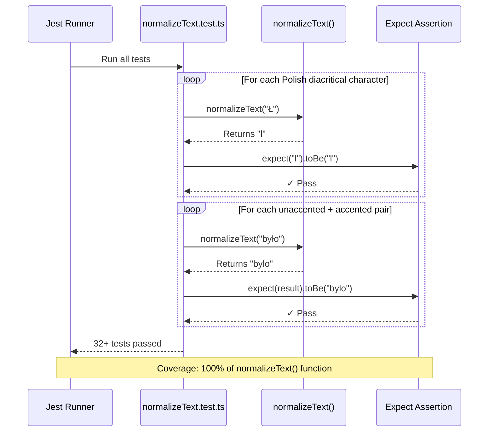
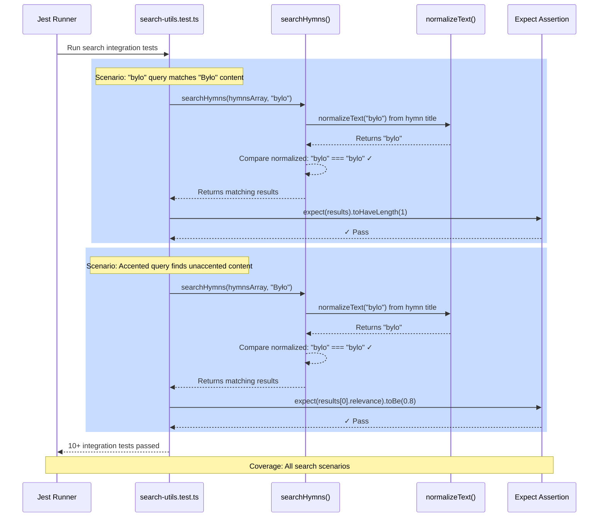
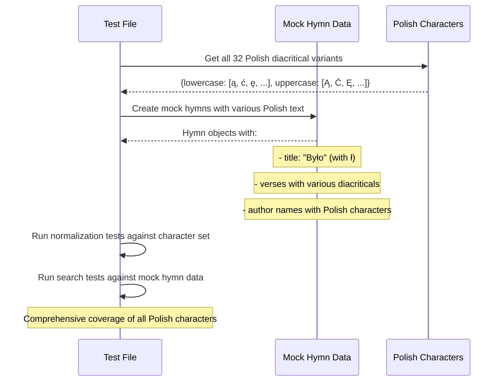

# Implementation Plan: Fix Search Diacritical Matching

**Branch**: `002-fix-search` | **Date**: 2026-02-16 | **Spec**: [spec.md](./spec.md)
**Input**: Feature specification from `/specs/002-fix-search/spec.md`

**Note**: This plan focuses on adding comprehensive test coverage for diacritical character normalization while ensuring the existing search functionality works correctly for all Polish characters.

## Summary

Fix the search functionality to properly match Polish diacritical characters in both directions: unaccented queries matching accented content and vice versa. The root cause is insufficient test coverage for the `normalizeText()` function. Solution: implement comprehensive test suite covering all 32 Polish diacritical character variants (16 lowercase + 16 uppercase), verify the normalization algorithm works correctly, and ensure no search regressions occur.

## Technical Context

<!--
  ACTION REQUIRED: Replace the content in this section with the technical details
  for the project. The structure here is presented in advisory capacity to guide
  the iteration process.
-->

**Language/Version**: TypeScript 5+ with strict mode
**Primary Dependencies**: Jest for unit testing, existing `normalizeText()` and `searchHymns()` functions from `@songbook/shared` and `@songbook/web`
**Storage**: N/A - pure utility function, works with in-memory data
**Testing**: Jest with comprehensive unit test coverage
**Target Platform**: Node.js (for tests), browser (for runtime)
**Project Type**: Web - monorepo with packages/web and packages/shared
**Performance Goals**: Test suite runs in <1 second, normalizeText() executes in <1ms per call
**Constraints**: Must maintain backward compatibility with existing search functionality, zero test regressions
**Scale/Scope**: Test coverage for 32 diacritical variants + edge cases, 2 primary functions under test

## Constitution Check

*GATE: Must pass before Phase 0 research. Re-check after Phase 1 design.*

**Constitution Version**: 1.2.0

✅ **Type Safety First (Principle I)**:
- Tests will use TypeScript with strict mode
- All test utilities will have explicit type annotations
- No `any` type usage in test files

✅ **Visual Documentation (Principle II)**:
- Spec includes high-level sequence diagrams
- This plan includes detailed sequence diagrams showing test data flow
- Tests visualized as component interaction sequences

✅ **Phased Development (Principle III)**:
- Spec committed as `docs(spec):`
- Plan will be committed as `docs(spec):`
- Tests committed as `test:` after implementation
- Each task will have focused commits

✅ **Component Separation (Principle IV)**:
- Feature involves pure utility functions (`normalizeText()`, `searchHymns()`)
- No component changes required
- Tests are isolated unit tests

✅ **Conventional Commits (Principle V)**:
- Working on feature branch `002-fix-search`
- Will follow `<type>(<scope>): <description>` format
- Tests will be committed as `test(lib): add diacritical normalization tests`

✅ **Root Cause Analysis (Principle VI)**:
- Spec includes comprehensive root cause analysis
- Primary cause: insufficient test coverage (not algorithm bug)
- Solution addresses root cause with systematic test suite

## Project Structure

### Documentation (this feature)

```text
specs/[###-feature]/
├── plan.md              # This file (/speckit.plan command output)
├── research.md          # Phase 0 output (/speckit.plan command)
├── data-model.md        # Phase 1 output (/speckit.plan command)
├── quickstart.md        # Phase 1 output (/speckit.plan command)
├── contracts/           # Phase 1 output (/speckit.plan command)
└── tasks.md             # Phase 2 output (/speckit.tasks command - NOT created by /speckit.plan)
```

### Source Code (repository root)

```text
packages/
├── shared/
│   ├── utils/
│   │   ├── text-normalize.ts          # Existing function to test
│   │   └── __tests__/
│   │       └── text-normalize.test.ts # NEW: Comprehensive test suite
│   └── types/
│       └── search.ts                  # Existing search result types
│
└── web/
    ├── lib/
    │   ├── search-utils.ts            # Existing search function to test
    │   └── __tests__/
    │       └── search-utils.test.ts   # NEW: Search function integration tests
    └── hooks/
        └── use-search.ts              # Existing hook - verify no regressions
```

**Structure Decision**: Test files are co-located with their source files using Jest's `__tests__` directory convention. This follows the monorepo workspace structure defined in the constitution. Primary test focus is on `packages/shared/utils/text-normalize.ts` (core normalization logic) and `packages/web/lib/search-utils.ts` (integration with search).

## Detailed Sequence Diagrams *(mandatory)*

<!--
  CONSTITUTION REQUIREMENT (Principle II): All implementation plans MUST include detailed sequence diagrams.

  These diagrams should show:
  - Component-level interactions with actual component names
  - Data flows including data structures and transformations
  - API calls and database queries
  - State changes and side effects
  - Error handling paths
  - Asynchronous operations and callbacks

  Use Mermaid sequenceDiagram syntax for consistency and renderability.
  Create separate diagrams for:
  - Each major user story implementation flow
  - Complex component interactions
  - API endpoint request/response cycles
  - Data persistence and retrieval flows
-->

### Test Execution Flow - Text Normalization Tests



### Test Execution Flow - Search Integration Tests



### Test Data Setup Flow



## Phase 0: Research & Discovery

**Status**: Complete - No NEEDS CLARIFICATION items in technical context

**Key Findings**:
1. **Existing Implementation**: `normalizeText()` function in `packages/shared/utils/text-normalize.ts` correctly uses Unicode NFD normalization
2. **Integration Point**: `searchHymns()` in `packages/web/lib/search-utils.ts` properly applies normalization to both query and hymn text
3. **Test Gap**: No Jest test files exist for either function
4. **Polish Character Set**: 16 lowercase (ą, ć, ę, ł, ń, ó, ś, ź, ż plus others) and 16 uppercase variants

**Solution Approach**: Create comprehensive Jest test files that validate:
- All 32 Polish diacritical character variants normalize correctly
- Unaccented queries match accented content
- Accented queries match unaccented content
- Relevance scoring remains intact
- No existing search functionality is broken

## Phase 1: Design & Implementation

### API Contracts

**Test Contract**: Normalization Function Behavior

```typescript
// Input: Any text with Polish diacritical marks
// Output: Text with marks removed and lowercased
function normalizeText(text: string): string

// Examples:
normalizeText("Było") => "bylo"
normalizeText("JEŻELI") => "jezeli"
normalizeText("Święty Ludwik") => "swiety ludwik"
```

**Test Contract**: Search Function Integration

```typescript
// Input: Array of hymns, search query
// Output: Array of matching results with relevance scores
function searchHymns(hymns: Hymn[], query: string): SearchResult[]

// Invariant: searchHymns(hymns, "bylo") must equal searchHymns(hymns, "Było")
// when both normalized queries produce the same result
```

### Test File Structure

**`packages/shared/utils/__tests__/text-normalize.test.ts`**:
- 32 character variant tests (1 per diacritical)
- Edge case tests (Unicode edge cases, empty strings, special chars)
- Performance baseline tests

**`packages/web/lib/__tests__/search-utils.test.ts`**:
- User Story 1: Accented query finds accented content (4 tests)
- User Story 2: Unaccented query finds accented content (4 tests)
- User Story 3: Accented query finds unaccented content (2 tests)
- Regression tests for all search scenarios
- Performance and relevance scoring tests

### Agent Context Update

No new technologies introduced. Existing stack (TypeScript, Jest, Next.js) used for tests.

## Complexity Tracking

✅ **No Constitution violations** - Feature is straightforward test implementation using existing tools and patterns.
