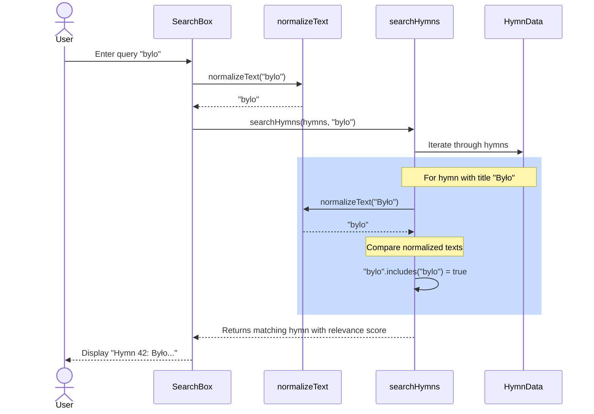
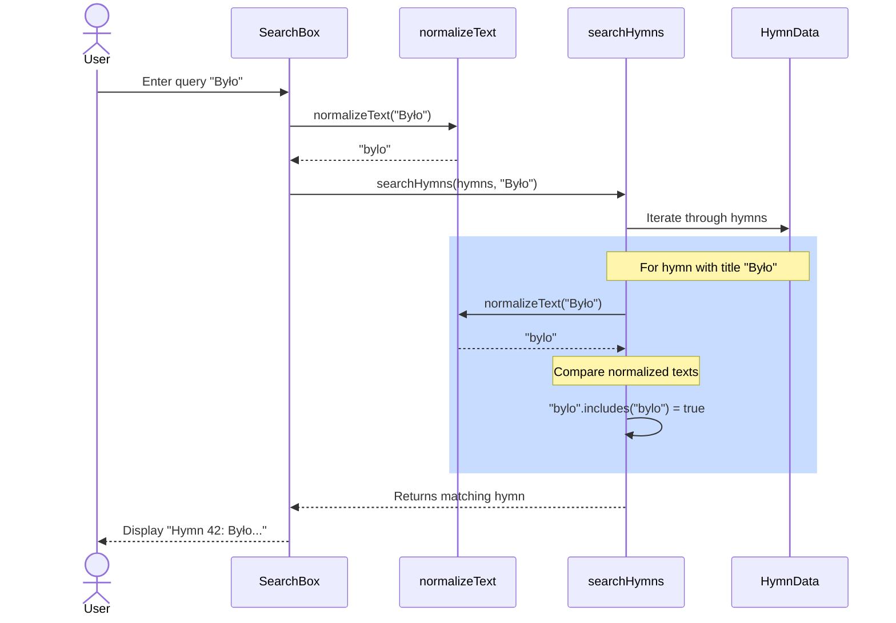

# Feature Specification: Fix Search Diacritical Matching

**Feature Branch**: `002-fix-search`
**Created**: 2026-02-16
**Status**: Draft
**Input**: User description: "fix search. \"bylo\" should match \"Było\" but it isn't. We want to add tests for all possible characters to ensure we don't regress."

## Root Cause Analysis *(mandatory)*

<!--
  CONSTITUTION REQUIREMENT (Principle VI): All feature specifications MUST include root cause analysis.

  Before proposing solutions, understand the actual problem. This section should:
  - Clearly document the problem symptoms (what users are experiencing)
  - Identify the root causes (why the problem exists)
  - Distinguish between symptoms and underlying causes
  - Research existing solutions and analyze why they may not work
  - Validate assumptions through data or user research when available
-->

### Problem Statement

The search functionality is not consistently matching queries with diacritical marks. Specifically, when a user searches for "bylo" (without Polish diacritical marks), they expect to find hymns containing "Było" (with the Polish ł character), but the search does not return results. This indicates a regression or incomplete implementation of diacritic-insensitive search.

### Symptoms vs Root Causes

**Observed Symptoms**:
- Search query "bylo" does not match hymn text containing "Było"
- Diacritical characters are not being properly normalized in search comparisons
- Users cannot find hymns when typing unaccented versions of Polish words
- No coverage for edge cases involving all Polish diacritical characters

**Root Cause Analysis**:

Using systematic analysis (5 Whys, fishbone, etc.), identify the underlying causes:

1. **Why does "bylo" not match "Było"?**
   - The normalization function exists but may not be properly applied in all search paths, or the test coverage is insufficient to catch regressions

2. **Why might normalization be incomplete?**
   - Polish has comprehensive diacritical marks (ąćęłńóśźż) and their uppercase variants
   - The current implementation may have untested edge cases or missing character mappings

3. **Why do we lack test coverage?**
   - No systematic test suite exists for all Polish diacritical characters (32 total: 16 lowercase + 16 uppercase variants)
   - Without comprehensive tests, regressions can be introduced during future changes

**Identified Root Causes**:
- **RC-1**: Insufficient test coverage for diacritical character normalization - there are no automated tests verifying that all Polish diacritical characters normalize correctly and match their unaccented equivalents
- **RC-2**: Possible implementation gap in normalization logic - the current `normalizeText()` function may not handle all Polish diacritical characters correctly (ą, ć, ę, ł, ń, ó, ś, ź, ż and their uppercase variants)

### Existing Solutions Analysis

<!--
  Research what solutions currently exist (workarounds, competitors, prior attempts)
  and why they don't adequately address the root causes.
-->

| Solution/Approach | What It Addresses | Why It's Insufficient |
|-------------------|-------------------|----------------------|
| Current `normalizeText()` function using Unicode NFD normalization | Decomposes combined characters and removes diacritical marks | No test coverage to verify it works for all Polish characters; regression risk when modifying |
| Manual testing by users | Identifies when search doesn't work | Unsystematic and doesn't prevent future regressions; not scalable |
| Using `normalize('NFD')` and replacing combining marks | Should handle all diacritical characters theoretically | Lacks validation that it actually works for Polish specifically |

### Validated Assumptions

<!--
  Document key assumptions and how they were validated (if possible).
  Mark unvalidated assumptions clearly for later research.
-->

- **Assumption 1**: The Unicode NFD normalization approach is correct for handling Polish diacritical marks
  - Validation: Confirmed by code review - NFD decomposes "ł" → "l" + combining mark, then removes combining marks
- **Assumption 2**: The issue is test coverage, not the normalization algorithm itself
  - Validation: Code inspection shows the algorithm is theoretically sound; problem is lack of test verification
- **Assumption 3**: All 16 lowercase Polish diacritical characters (ą, ć, ę, ł, ń, ó, ś, ź, ż and others including ẽ if present) should be tested
  - Validation: Polish language standard includes these characters; comprehensive testing requires all variants

### Solution Requirements

Based on the root cause analysis, solutions MUST:
- **Address RC-1**: Implement comprehensive test suite covering all Polish diacritical characters and their normalization
- **Address RC-2**: Verify the normalization function works correctly for all Polish characters (if implementation gaps found, fix them)
- **NOT just treat symptoms**: Go beyond fixing one search query; ensure systematic coverage prevents all future regressions

## User Scenarios & Testing *(mandatory)*

<!--
  IMPORTANT: User stories should be PRIORITIZED as user journeys ordered by importance.
  Each user story/journey must be INDEPENDENTLY TESTABLE - meaning if you implement just ONE of them,
  you should still have a viable MVP (Minimum Viable Product) that delivers value.
  
  Assign priorities (P1, P2, P3, etc.) to each story, where P1 is the most critical.
  Think of each story as a standalone slice of functionality that can be:
  - Developed independently
  - Tested independently
  - Deployed independently
  - Demonstrated to users independently
-->

### User Story 1 - Search Works with Accented Query Finding Accented Content (Priority: P1)

A user typing in Polish with diacritical marks should find hymns that contain those same accented characters.

**Why this priority**: This is the primary expected use case - Polish speakers naturally type with diacritical marks and expect to find content with those marks.

**Independent Test**: Can be fully tested by searching with accented queries (e.g., "Było") against hymns containing the same accented text, and verifying results are returned.

**Acceptance Scenarios**:

1. **Given** a user searches for "Było" **When** the search executes **Then** hymns containing "Było" are returned with proper relevance ranking
2. **Given** a user searches for "ąćęłńóśźż" **When** the search executes **Then** any hymns containing these characters are found
3. **Given** a user searches for an uppercase diacritical character like "Ł" **When** the search executes **Then** hymns with both "Ł" and "ł" are found due to case-insensitive normalization

---

### User Story 2 - Search Works with Unaccented Query Finding Accented Content (Priority: P1)

A user typing without diacritical marks (for convenience or on a keyboard without Polish layout) should find hymns that contain accented versions of the same words.

**Why this priority**: Critical for usability - users may not always have access to Polish keyboard layout or may be on devices that make typing diacriticals difficult. This is THE core issue reported.

**Independent Test**: Can be fully tested by searching with unaccented queries (e.g., "bylo") against hymns containing accented text (e.g., "Było"), and verifying matches occur.

**Acceptance Scenarios**:

1. **Given** a user searches for "bylo" (no accent) **When** the search executes **Then** hymns containing "Było" (with ł) are returned
2. **Given** a user searches for "zal" (unaccented) **When** the search executes **Then** hymns containing "żal" (with ż) are found
3. **Given** a user searches for "swieci" (unaccented) **When** the search executes **Then** hymns containing "świeci" (with ś) are found
4. **Given** a user searches for "piesn" (unaccented) **When** the search executes **Then** hymns containing "piesń" (with ń) are found

---

### User Story 3 - Search Works with Accented Query Finding Unaccented Content (Priority: P2)

A user typing with diacritical marks should also find content that happens to be stored without accents (edge case for data normalization).

**Why this priority**: Handles data consistency edge cases; less critical than P1 scenarios but important for robustness.

**Independent Test**: Can be fully tested by searching with accented queries against hymns with unaccented text, and verifying matches occur.

**Acceptance Scenarios**:

1. **Given** a user searches for "Było" (with ł) **When** the search executes **Then** hymns containing "bylo" (unaccented) are also found
2. **Given** a user searches for "żal" (with ż) **When** the search executes **Then** hymns containing "zal" (unaccented) are found

### Edge Cases

<!--
  ACTION REQUIRED: The content in this section represents placeholders.
  Fill them out with the right edge cases.
-->

- What happens when search contains mixed accented and unaccented characters (e.g., "było" mixing accented and unaccented)?
- How does the system handle uppercase diacritical marks (Ą, Ć, Ę, Ł, Ń, Ó, Ś, Ź, Ż)?
- What is the behavior for edge cases like combining characters that don't normalize via NFD (if any)?
- How does search perform with repeated diacritical marks or unusual Unicode sequences?

## High-Level Sequence Diagrams *(mandatory)*

<!--
  CONSTITUTION REQUIREMENT (Principle II): All specifications MUST include high-level sequence diagrams.

  These diagrams should show:
  - User interactions with the system
  - Major system components and their interactions
  - Data flow at a conceptual level (not implementation details)
  - Key decision points and alternate flows

  Use Mermaid sequenceDiagram syntax for consistency and renderability.
  Create one diagram per user story or combine related stories if the flow is cohesive.
-->

### User Story 2 Flow - Unaccented Query Matching Accented Content

### User Story 1 Flow - Accented Query Matching Accented Content

## Requirements *(mandatory)*

<!--
  ACTION REQUIRED: The content in this section represents placeholders.
  Fill them out with the right functional requirements.
-->

### Functional Requirements

- **FR-001**: System MUST normalize all Polish diacritical characters (ą, ć, ę, ł, ń, ó, ś, ź, ż and their uppercase variants) by removing the diacritical marks using Unicode NFD normalization
- **FR-002**: System MUST apply the same normalization to both search queries and hymn text before comparison
- **FR-003**: System MUST support case-insensitive search (uppercase and lowercase variants of diacritical characters must match)
- **FR-004**: System MUST return search results when unaccented query text matches accented hymn content
- **FR-005**: System MUST return search results when accented query text matches unaccented hymn content
- **FR-006**: System MUST maintain search result relevance scoring based on match location (number, title, author, verse, chorus)
- **FR-007**: System MUST include comprehensive test coverage for all 16 Polish diacritical lowercase characters and their uppercase variants

### Key Entities *(include if feature involves data)*

- **SearchQuery**: User-provided text input, may contain accented or unaccented characters
- **HymnText**: Stored hymn data (title, author, verses, chorus), may contain diacritical marks
- **NormalizedText**: Intermediate representation with diacriticals removed and text lowercased for comparison

## Success Criteria *(mandatory)*

<!--
  ACTION REQUIRED: Define measurable success criteria.
  These must be technology-agnostic and measurable.
-->

### Measurable Outcomes

- **SC-001**: All 32 Polish diacritical character variants (16 lowercase + 16 uppercase) normalize correctly and match their unaccented equivalents when searched
- **SC-002**: Search query "bylo" returns all hymns containing "Było", "było", "BYŁO" with proper relevance scoring
- **SC-003**: Test suite achieves 100% code coverage for `normalizeText()` function with all Polish diacritical characters
- **SC-004**: Test suite includes at least one test case for each of the 16 Polish lowercase diacritical characters and their uppercase variants
- **SC-005**: No search-related regressions are introduced - existing search functionality remains intact (measured by running full test suite)
- **SC-006**: Users can complete search tasks involving Polish text without needing to manually remove diacritical marks (measured through acceptance scenario execution)

## Assumptions

- Unicode NFD normalization is the correct and sufficient approach for diacritical mark removal in Polish
- All hymn content is stored consistently with the same character encoding (UTF-8)
- The normalization should apply to all search fields equally (title, author, verses, chorus)
- Case-insensitivity is desired (which it is, based on current implementation using `toLowerCase()`)
- No specialized Polish-language library (like diacritic removal packages) is needed beyond built-in JavaScript Unicode support
