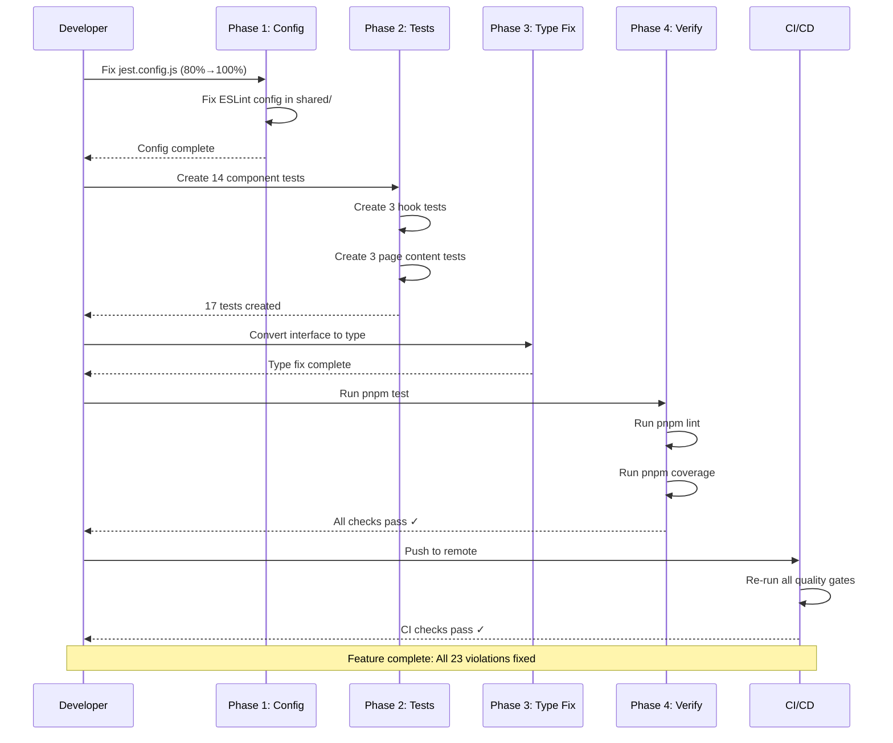
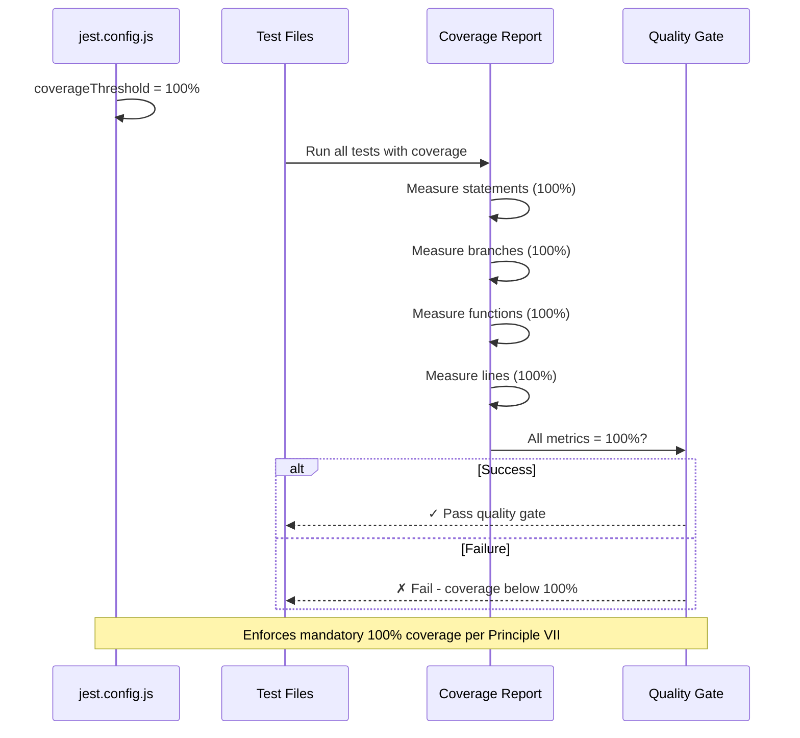

# Implementation Plan: Fix Rule and Constitutional Violations

**Branch**: `003-fix-violations` | **Date**: 2026-02-16 | **Spec**: [specs/003-fix-violations/spec.md](./spec.md)
**Input**: Feature specification from `/specs/003-fix-violations/spec.md`

## Summary

Fix all 23 identified rule and constitutional violations across Rules 110, 410, 510, and 520. The violations prevent developers from running pre-commit quality gates (`pnpm test && pnpm lint && pnpm coverage`) successfully. The implementation focuses on: (1) updating jest.config.js to enforce 100% coverage, (2) creating 17 missing test files for components, hooks, and pages, (3) configuring ESLint in the shared package, and (4) converting one interface to type. The final deliverable must pass all quality gates while allowing intermediate commits to be non-compliant per user exception.

## Technical Context

This feature is about enforcing existing rules and standards already documented in the constitution and rules. No new technologies are introduced - all tools and standards are already in place.

**Language/Version**: TypeScript 5+ with strict mode enabled (already required by Rule 110)
**Primary Dependencies**: Jest (testing), ESLint (linting), pnpm (package manager)
**Storage**: N/A (configuration fixes only, no data storage)
**Testing**: Jest with React Testing Library (already configured, expanding coverage)
**Target Platform**: Web/Next.js application (already monorepo with pnpm workspaces)
**Project Type**: Monorepo with web and shared packages (pnpm workspaces)
**Performance Goals**: N/A (standards enforcement, not performance optimization)
**Constraints**: 100% code coverage mandatory (Rule 410), zero linting errors (Rule 410), Node 24 required (Rule 510), pnpm 10+ required (Rule 520)
**Scale/Scope**: Fixing 23 violations across 2 packages (web and shared); 17 new test files to create; no new features added

## Constitution Check

*GATE: Must pass before Phase 0 research. Re-check after Phase 1 design.*

### Principles Applicable to This Feature

**Principle I: Type Safety First** ✅
- FR-006 requires converting interface to type (fixes 1 violation)
- No `any` types will be introduced in test files
- All test utilities will have explicit types
- Status: No conflicts, fully aligned

**Principle II: Visual Documentation** ✅
- Implementation plan includes detailed sequence diagrams showing test file organization
- No diagrams required for configuration fixes (non-architectural)
- Status: Aligned (diagrams included below)

**Principle III: Phased Development** ✅
- Implementation organized into phases with commit points
- Phase 1: Configuration fixes (jest.config.js, ESLint setup)
- Phase 2: Test files for components, hooks, pages
- Phase 3: Type definition fix
- Phase 4: Verification and cleanup
- Status: Plan follows phased approach

**Principle IV: Component Separation** ✅
- Tests will verify component separation, not violate it
- No changes to component architecture
- Status: No violations introduced

**Principle V: Conventional Commits** ✅
- All commits will follow conventional format
- Commits organized by logical units (configuration, component tests, hook tests, etc.)
- Exception granted for intermediate commits per user input
- Final commit must pass all quality gates
- Status: Compliant

**Principle VI: Root Cause Analysis** ✅
- This feature directly addresses RCA from spec (RC-1 through RC-5)
- Solutions address root causes, not symptoms
- Status: Fully compliant

**Principle VII: Pre-Commit Quality Gates** ✅
- **This feature's PURPOSE is to enable Principle VII enforcement**
- Final result must pass `pnpm test && pnpm lint && pnpm coverage`
- All test files must achieve 100% coverage
- All linting must pass with zero errors/warnings
- Status: Feature enables this principle

### Gate Status
**✅ PASS** - No constitutional violations. Feature directly enables Principle VII compliance and improves overall constitutional adherence through test coverage and linting enforcement.

## Project Structure

### Documentation (this feature)

```text
specs/003-fix-violations/
├── spec.md                          # Feature specification (already created)
├── plan.md                          # This file - implementation plan
├── research.md                      # Phase 0 research (to be created)
├── data-model.md                    # Phase 1 design (N/A - no data models)
├── quickstart.md                    # Phase 1 quickstart (to be created)
├── contracts/                       # Phase 1 contracts (N/A - no API contracts)
├── checklists/
│   └── requirements.md              # Quality checklist (already created)
└── tasks.md                         # Phase 2 task breakdown (created by /speckit.tasks)
```

### Source Code Structure (Monorepo with pnpm Workspaces)

This is an existing Next.js monorepo. No new directories needed - fixes are made in-place:

```text
packages/
├── web/                             # Next.js web application
│   ├── components/                  # Presentational components
│   │   ├── category/                # Components needing tests
│   │   ├── common/                  # Components needing tests
│   │   ├── layout/                  # Components needing tests
│   │   ├── search/                  # Components needing tests
│   │   └── song/                    # Components needing tests
│   │
│   ├── hooks/                       # Custom hooks
│   │   ├── use-debounce.ts          # Needs test file
│   │   ├── use-offline.ts           # Needs test file
│   │   └── use-search.ts            # Needs test file
│   │
│   ├── app/                         # Next.js App Router (page content)
│   │   ├── song/[number]/
│   │   │   ├── content.tsx          # Needs test file
│   │   │   └── page.tsx
│   │   ├── category/subcategory/[number]/
│   │   │   ├── content.tsx          # Needs test file
│   │   │   └── page.tsx
│   │   ├── page.tsx                 # Needs test file
│   │   └── layout.tsx
│   │
│   ├── jest.config.js               # FIX: Update coverage to 100%
│   ├── eslint.config.mjs            # Already configured
│   └── __tests__/                   # Test files
│       └── [component-tests]/       # New test files created here
│
└── shared/                          # Shared code
    ├── utils/
    │   ├── __tests__/
    │   │   ├── text-normalize.test.ts
    │   │   └── test-utils.ts        # FIX: Change interface to type
    │   └── [utilities]/
    │
    └── [missing]: eslint.config.mjs # FIX: Create ESLint configuration
```

**Fixes Breakdown**:
- **Configuration (2 files)**:
  - `/packages/web/jest.config.js`: Change coverage threshold 80% → 100%
  - `/packages/shared/eslint.config.mjs`: Create ESLint config (copy from web)

- **Test Files (17 files to create)**:
  - 14 component test files in `/packages/web/components/`
  - 3 hook test files in `/packages/web/hooks/`
  - 3 page content test files in `/packages/web/app/`

- **Type Fixes (1 file)**:
  - `/packages/shared/utils/__tests__/test-utils.ts`: interface → type

## Detailed Sequence Diagrams *(mandatory)*

<!--
  CONSTITUTION REQUIREMENT (Principle II): All implementation plans MUST include detailed sequence diagrams.

  These diagrams should show:
  - Component-level interactions with actual component names
  - Data flows including data structures and transformations
  - API calls and database queries
  - State changes and side effects
  - Error handling paths
  - Asynchronous operations and callbacks

  Use Mermaid sequenceDiagram syntax for consistency and renderability.
  Create separate diagrams for:
  - Each major user story implementation flow
  - Complex component interactions
  - API endpoint request/response cycles
  - Data persistence and retrieval flows
-->

### Phase Execution Flow Diagram



### Test Coverage Architecture



## Implementation Phases Detailed

### Phase 1: Configuration Fixes (Foundation)

**Objective**: Update configuration files to enforce standards

1. **Fix jest.config.js** (`/packages/web/jest.config.js`)
   - Change `statements: 80` → `100`
   - Change `branches: 80` → `100`
   - Change `functions: 80` → `100`
   - Change `lines: 80` → `100`
   - Commit: `fix(config): update web jest coverage threshold to 100%`

2. **Create ESLint config in shared** (`/packages/shared/eslint.config.mjs`)
   - Copy configuration from `/packages/web/eslint.config.mjs`
   - Ensure consistency across both packages
   - Commit: `fix(config): add ESLint configuration to shared package`

**Checkpoint**: Configuration changes complete, ready for test file creation

### Phase 2: Test File Creation (Core Work)

**Objective**: Create 17 test files for untested components, hooks, and pages

**Component Tests (14 files)**:
- `/packages/web/components/category/category-accordion.test.tsx`
- `/packages/web/components/category/category-item.test.tsx`
- `/packages/web/components/common/language-toggle.test.tsx`
- `/packages/web/components/common/offline-indicator.test.tsx`
- `/packages/web/components/layout/header.test.tsx`
- `/packages/web/components/search/search-box.test.tsx`
- `/packages/web/components/search/search-results.test.tsx`
- `/packages/web/components/song/category-badge.test.tsx`
- `/packages/web/components/song/song-card.test.tsx`
- `/packages/web/components/song/song-details.test.tsx`
- `/packages/web/components/song/verse-display.test.tsx`

Commit pattern: `test(components): add tests for [component-name]`

**Hook Tests (3 files)**:
- `/packages/web/hooks/use-debounce.test.ts`
- `/packages/web/hooks/use-offline.test.ts`
- `/packages/web/hooks/use-search.test.ts`

Commit pattern: `test(hooks): add tests for [hook-name]`

**Page Content Tests (3 files)**:
- `/packages/web/app/song/[number]/content.test.tsx`
- `/packages/web/app/category/subcategory/[number]/content.test.tsx`
- `/packages/web/app/page.test.tsx`

Commit pattern: `test(pages): add tests for [page-name]`

**Checkpoint**: All 17 test files created, tests pass, coverage meets 100%

### Phase 3: Type Definition Fixes

**Objective**: Ensure TypeScript standard compliance (Rule 110)

1. **Convert interface to type** (`/packages/shared/utils/__tests__/test-utils.ts`)
   - Line 156: `export interface SearchResultValidator` → `export type SearchResultValidator`
   - Commit: `fix(types): convert interface to type in test-utils`

**Checkpoint**: Type definition compliant with Rule 110

### Phase 4: Final Verification

**Objective**: Verify all quality gates pass

1. **Run complete quality gate sequence**:
   ```bash
   pnpm test          # All tests pass
   pnpm lint          # Zero errors/warnings
   pnpm coverage      # 100% coverage
   ```

2. **Verify each requirement**:
   - FR-001: ✓ Coverage threshold 100% configured
   - FR-002: ✓ All components have tests
   - FR-003: ✓ All hooks have tests
   - FR-004: ✓ All pages have tests
   - FR-005: ✓ ESLint configured in shared
   - FR-006: ✓ Types use `type` keyword
   - FR-007: ✓ Quality gates execute successfully
   - FR-008: ✓ Documentation reflects fixes
   - FR-009: ✓ 100% compliance achieved

3. **Final commit**:
   ```
   docs(spec): complete violation fixes achieving 100% compliance

   Fixes all 23 identified violations:
   - Coverage threshold updated to 100% (packages/web)
   - 17 test files created for components, hooks, pages
   - ESLint configured in shared package
   - Type definition converted from interface to type

   All quality gates pass:
   ✓ pnpm test (100% success)
   ✓ pnpm lint (zero errors/warnings)
   ✓ pnpm coverage (100% coverage)

   Enables enforcement of Principle VII (Pre-Commit Quality Gates)

   Co-Authored-By: Claude Haiku 4.5 <noreply@anthropic.com>
   ```

## Implementation Notes

### Test File Structure

Each test file follows this pattern (React Testing Library for components):

```typescript
import { render, screen } from '@testing-library/react'
import { ComponentName } from './component-name'

describe('ComponentName', () => {
  // Test cases achieving 100% coverage:
  // - Render successfully
  // - Props passed correctly
  // - User interactions trigger callbacks
  // - Edge cases handled
  // - Error states displayed
})
```

### Achieving 100% Coverage

Coverage includes:
- **Line coverage**: Every line executed
- **Branch coverage**: All conditional branches tested
- **Function coverage**: All functions called
- **Statement coverage**: All statements executed

No dead code or unreachable branches (already clean codebase).

## Success Metrics

- [ ] jest.config.js updated to 100% threshold
- [ ] ESLint configured in shared package
- [ ] 17 test files created
- [ ] All tests pass (pnpm test)
- [ ] All linting passes (pnpm lint)
- [ ] Coverage at 100% (pnpm coverage)
- [ ] Interface converted to type
- [ ] Final commit passes all quality gates
- [ ] 23/23 violations fixed ✓
