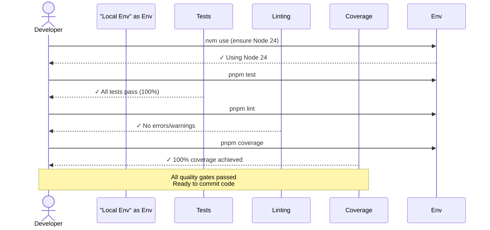
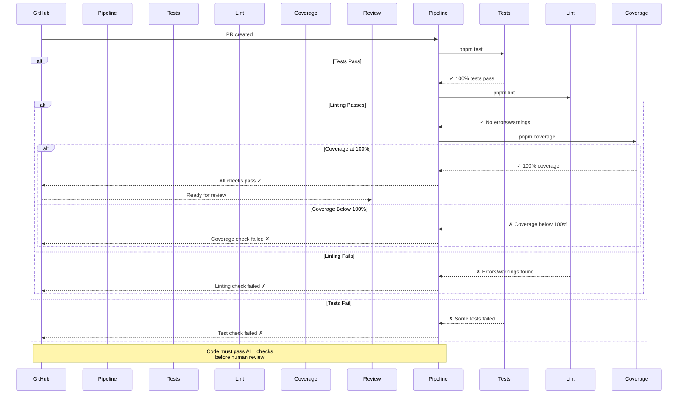
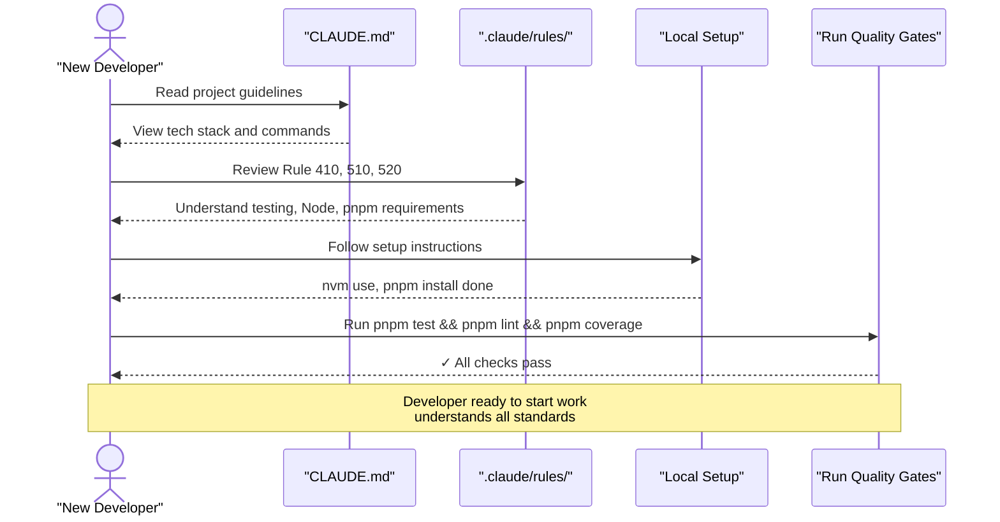

# Feature Specification: Fix Rule and Constitutional Violations

**Feature Branch**: `003-fix-violations`
**Created**: 2026-02-16
**Status**: Draft
**Input**: User description: "Fix all the rule and constitutional violations in this repo. During the process of creating and implementing this fix. We will make an exception to the rules around precommit checks (such as testing and linting), for intermediate commits, but the end result will follow all the rules"

## Root Cause Analysis *(mandatory)*

<!--
  CONSTITUTION REQUIREMENT (Principle VI): All feature specifications MUST include root cause analysis.

  Before proposing solutions, understand the actual problem. This section should:
  - Clearly document the problem symptoms (what users are experiencing)
  - Identify the root causes (why the problem exists)
  - Distinguish between symptoms and underlying causes
  - Research existing solutions and analyze why they may not work
  - Validate assumptions through data or user research when available
-->

### Problem Statement

The codebase has accumulated 23 violations of established rules and constitutional principles across Rules 110, 410, 510, and 520. These violations prevent developers from committing code while maintaining compliance with Principle VII (Pre-Commit Quality Gates), which requires 100% test coverage, passing linting, and passing all tests before any commit.

The repository currently cannot enforce these pre-commit quality gates because the test coverage is configured at 80% instead of 100%, 17 components and hooks have no test files, one package lacks ESLint configuration, and one test file uses incorrect type definition syntax. Developers face an impossible situation: they cannot achieve 100% coverage even when trying to follow standards.

### Symptoms vs Root Causes

**Observed Symptoms**:
- Pre-commit quality gates cannot pass (impossible to reach 100% coverage with 17 missing test files)
- Coverage threshold configured at 80% contradicts constitutional requirement of 100%
- ESLint configuration missing from shared package (web package has it, but shared doesn't)
- One test file uses `interface` instead of `type` keyword
- 17 untested components, hooks, and pages exist in the codebase

**Root Cause Analysis**:

1. **Why is test coverage at 80% instead of 100%?**
   - jest.config.js was initialized with default 80% threshold (common practice in some projects)
   - Rules 410 and Principle VII mandating 100% were not reviewed during configuration
   - No governance process validated configuration against constitutional requirements

2. **Why do 17 components and hooks lack tests?**
   - Early development focused on feature implementation over comprehensive test coverage
   - No enforcement mechanism prevented incomplete components from being committed
   - Test-first development (TDD) was not enforced during early phases

3. **Why does shared package lack ESLint config?**
   - Shared package was created without replicating configuration from web package
   - Rule 410 requirement for linting configuration was not applied uniformly
   - No validation process ensured consistency across packages

4. **Why is one type definition an interface?**
   - Test utility predates Rule 110 standardization on `type` over `interface`
   - No automated enforcement exists for this convention

**Identified Root Causes**:
- **RC-1**: No enforcement of constitutional requirements during development - violations accumulate unchecked
- **RC-2**: Missing test files for components and hooks developed before this enforcement began
- **RC-3**: Coverage threshold allows untested code to pass, violating Principle VII
- **RC-4**: Inconsistent configuration across packages (linting setup not replicated)
- **RC-5**: No automated tooling prevents violations or enforces standards

### Existing Solutions Analysis

| Solution/Approach | What It Addresses | Why It's Insufficient |
|-------------------|-------------------|----------------------|
| Constitutional principles documented | Communicates intent and requirements | Cannot prevent violations during development; requires manual enforcement |
| Pre-commit hooks could exist | Would block commits not meeting quality gates | Currently not set up; developers must manually run gates |
| CI/CD enforcement | Would catch violations before merge | Only protects remote branches; doesn't prevent local violations |
| Manual code review | Could catch some violations | Depends on reviewer knowledge; retrospective, not preventive |
| Static analysis tools | Could detect some violations | Not configured to enforce all rule requirements |

### Validated Assumptions

- **Assumption 1**: All existing React components should have test files (they are presentational components per Rule 210)
  - Validation: Rule 410 lines 62-76 and Rule 210 mandate comprehensive component testing with no documented exceptions
- **Assumption 2**: Coverage threshold should be 100% (not 80%)
  - Validation: Principle VII of constitution, Rule 410 lines 37-42 and 88-91 both explicitly state "mandatory" for 100% coverage
- **Assumption 3**: All custom hooks should have test files
  - Validation: Rule 410 lines 66-69 explicitly require unit tests for all custom hooks
- **Assumption 4**: All packages should have ESLint configuration
  - Validation: Rule 410 lines 156-164 state "Configuration enforced via committed `.eslintrc.js` or `eslint.config.js`"
- **Assumption 5**: The exception for pre-commit checks applies only to intermediate commits during this feature
  - Validation: User input explicitly states "We will make an exception to the rules around precommit checks (such as testing and linting), for intermediate commits, but the end result will follow all the rules"

### Solution Requirements

Based on the root cause analysis, solutions MUST:
- **Address RC-1**: Create comprehensive test coverage to meet Principle VII requirements
- **Address RC-2**: Develop test files for all 17 untested components, hooks, and pages
- **Address RC-3**: Update coverage threshold configuration to 100% to prevent untested code
- **Address RC-4**: Create ESLint configuration in shared package for consistency
- **Address RC-5**: Fix type definition inconsistency to comply with Rule 110
- **NOT just treat symptoms**: Going beyond individual fixes to establish patterns that prevent future violations
- **Enable governance**: Final result must pass all quality gates to establish this as the new standard

## User Scenarios & Testing *(mandatory)*

<!--
  IMPORTANT: User stories should be PRIORITIZED as user journeys ordered by importance.
  Each user story/journey must be INDEPENDENTLY TESTABLE - meaning if you implement just ONE of them,
  you should still have a viable MVP (Minimum Viable Product) that delivers value.
  
  Assign priorities (P1, P2, P3, etc.) to each story, where P1 is the most critical.
  Think of each story as a standalone slice of functionality that can be:
  - Developed independently
  - Tested independently
  - Deployed independently
  - Demonstrated to users independently
-->

### User Story 1 - Developer Runs Pre-Commit Quality Gates (Priority: P1)

A developer completes a feature and wants to commit their work. They run `pnpm test && pnpm lint && pnpm coverage` as required by Principle VII and Rule 410 to verify compliance before creating a commit.

**Why this priority**: P1 because this is the primary workflow for all developers. If quality gates pass, all other stories are automatically satisfied. This is the foundation for all development work.

**Independent Test**: Can be fully tested by running `pnpm test && pnpm lint && pnpm coverage` in the repository root and verifying exit code is 0, indicating all tests pass, linting succeeds, and coverage reaches 100%.

**Acceptance Scenarios**:

1. **Given** developer has the fixed codebase checked out, **When** they run `pnpm test`, **Then** all tests pass with 100% success rate
2. **Given** developer has the fixed codebase, **When** they run `pnpm lint`, **Then** no linting errors or warnings appear in any package
3. **Given** developer has the fixed codebase, **When** they run `pnpm coverage`, **Then** code coverage is 100% across all metrics (statements, branches, functions, lines)

---

### User Story 2 - Code Reviewer Verifies Compliance (Priority: P2)

A code reviewer examines an incoming pull request and needs to verify that all code complies with Rules 410, 510, 520, 110, and Principle VII before approving the merge.

**Why this priority**: P2 because it supports the governance process. While P1 fixes the violations, P2 ensures the fixes are validated by human review and CI/CD checks pass.

**Independent Test**: Can be fully tested by examining pull request checks - all CI/CD quality gate checks should pass without any rule violations marked in the code review.

**Acceptance Scenarios**:

1. **Given** a pull request with the violation fixes, **When** CI/CD runs quality gates, **Then** all checks pass (linting, testing, coverage)
2. **Given** a code reviewer examines the fixed codebase, **When** they verify against all rules, **Then** no violations remain
3. **Given** the fixed repository state, **When** documentation is reviewed, **Then** all rules are correctly reflected in CLAUDE.md and rule files

---

### User Story 3 - New Developer Joins and Understands Standards (Priority: P3)

A new developer joins the team and needs to quickly understand what standards apply, where they're documented, and how to maintain compliance.

**Why this priority**: P3 because it's supportive infrastructure for preventing future violations. While less critical than fixing current violations, it's important for team onboarding and preventing regression.

**Independent Test**: Can be fully tested by providing CLAUDE.md and `.claude/rules/` documentation to a new developer and verifying they can: (1) identify all applicable rules, (2) run quality gates successfully, (3) understand expectations for testing and code quality.

**Acceptance Scenarios**:

1. **Given** a new developer reads CLAUDE.md and .claude/rules/ documentation, **When** they check the test requirements, **Then** they understand Rule 410 mandates 100% coverage and how to achieve it
2. **Given** a developer completes the initial setup, **When** they run the quality gate commands, **Then** all checks pass
3. **Given** documentation is complete, **When** new developers read it, **Then** they can explain all 7 principles and corresponding rules

---

### Edge Cases

- What happens when a developer tries to run quality gates with Node 18 or 22? Rule 510 requires Node 24 via `nvm use` - they should be prevented
- What happens when a developer tries to use `npm install` instead of `pnpm`? Rule 520 forbids this - it should not work or should be blocked by pre-commit hook
- What happens when test coverage drops below 100%? `pnpm coverage` command should fail with exit code 1, preventing commits
- What happens when new code is added without corresponding tests? Coverage metrics will drop below 100%, preventing commits per Principle VII

## High-Level Sequence Diagrams *(mandatory)*

<!--
  CONSTITUTION REQUIREMENT (Principle II): All specifications MUST include high-level sequence diagrams.

  These diagrams should show:
  - User interactions with the system
  - Major system components and their interactions
  - Data flow at a conceptual level (not implementation details)
  - Key decision points and alternate flows

  Use Mermaid sequenceDiagram syntax for consistency and renderability.
  Create one diagram per user story or combine related stories if the flow is cohesive.
-->

### User Story 1 Flow - Developer Running Quality Gates

### User Story 2 Flow - CI/CD Validation

### User Story 3 Flow - New Developer Learning Standards

## Requirements *(mandatory)*

<!--
  ACTION REQUIRED: The content in this section represents placeholders.
  Fill them out with the right functional requirements.
-->

### Functional Requirements

- **FR-001**: Repository MUST have 100% code coverage configured in jest.config.js for all packages (fixes RC-3, complies with Rule 410 and Principle VII)
- **FR-002**: All React components in `/packages/web/components/` MUST have corresponding test files documenting behavior (fixes RC-2)
- **FR-003**: All custom hooks in `/packages/web/hooks/` MUST have corresponding test files (fixes RC-2)
- **FR-004**: All page content components MUST have corresponding test files (fixes RC-2)
- **FR-005**: ESLint MUST be configured in `/packages/shared/` with same standards as `/packages/web/` (fixes RC-4)
- **FR-006**: All type definitions in test utilities MUST use `type` keyword instead of `interface` (complies with Rule 110)
- **FR-007**: Repository MUST successfully execute `pnpm test && pnpm lint && pnpm coverage` with exit code 0 (enables Principle VII enforcement)
- **FR-008**: CLAUDE.md and `.claude/rules/` MUST clearly document all fixed violations and how to maintain compliance (prevents RC-1 recurrence)
- **FR-009**: All 23 identified rule violations MUST be corrected, achieving 100% compliance with Rules 410, 510, 520, and 110

### Key Entities

- **Test File**: A `.test.ts` or `.test.tsx` file containing Jest tests that document component or hook behavior and achieve 100% code coverage
- **Coverage Report**: Output from `pnpm coverage` command showing 100% line, branch, function, and statement coverage
- **Linting Report**: Output from `pnpm lint` command with zero errors and zero warnings across all packages
- **Quality Gate**: A prerequisite check (tests, linting, coverage) that must pass before code can be committed (Principle VII)

## Success Criteria *(mandatory)*

<!--
  ACTION REQUIRED: Define measurable success criteria.
  These must be technology-agnostic and measurable.
-->

### Measurable Outcomes

- **SC-001**: All 23 identified rule violations are fixed (100% compliance rate on Rules 110, 410, 510, 520)
- **SC-002**: `pnpm test` command passes with 100% test success rate (zero failing tests)
- **SC-003**: `pnpm lint` command passes with zero errors and zero warnings across all packages (web and shared)
- **SC-004**: `pnpm coverage` command reports 100% coverage across all metrics: statements, branches, functions, and lines
- **SC-005**: Final commit of this feature branch passes all quality gates: `pnpm test && pnpm lint && pnpm coverage` with exit code 0
- **SC-006**: Documentation in CLAUDE.md, Rules 410, 510, 520, 110, and Constitution is updated to reflect fixed state
- **SC-007**: New developers reading CLAUDE.md can understand all applicable standards and run quality gates successfully
- **SC-008**: Repository is ready to enforce Principle VII (Pre-Commit Quality Gates) as permanent standard with no regressions

## Dependencies and Assumptions

### External Dependencies
- Node.js 24 (Rule 510) - must be installed via nvm
- pnpm 10+ (Rule 520) - must be installed globally
- Jest and testing libraries - already installed in package.json
- ESLint - already installed in web package, needs to be configured in shared package

### Implementation Dependencies
This feature depends on the 4 rules already being in place:
- Rule 110: TypeScript Standards (type vs interface)
- Rule 410: Testing and Pre-Commit Quality Gates
- Rule 510: Node.js Version Management
- Rule 520: pnpm Package Manager Requirement
- Principle VII of Constitution: Pre-Commit Quality Gates

### Key Assumptions
- **Assumption 1**: All existing components are presentational (per Rule 210) and should be tested
  - Validation: Rule 210 and Rule 410 mandate this; no documented exceptions exist
- **Assumption 2**: Coverage threshold should be 100% with no lower threshold for any package
  - Validation: Principle VII and Rule 410 explicitly state "100% code coverage is mandatory" (lines 37-42 and 88-91)
- **Assumption 3**: All packages should have identical ESLint configuration standards
  - Validation: Rule 410 lines 156-164 requires configuration in all packages
- **Assumption 4**: The exception for pre-commit checks applies ONLY to intermediate commits during this feature implementation
  - Validation: User input explicitly states "for intermediate commits, but the end result will follow all the rules"
- **Assumption 5**: No existing code violates Rules 110, 510, or 520 (only Rule 410 violations exist)
  - Validation: Violation analysis report confirms only Rule 410, 110 (minor), and configuration violations

## Out of Scope

The following are NOT part of this specification (they're separate features):
- Adding new features or functionality beyond compliance fixes
- Refactoring existing code beyond what's necessary for testing
- Modifying business logic or application behavior
- Changing the architecture or component design
- Adding optional features or "nice to have" improvements

This feature is purely about bringing the existing codebase into compliance with established rules and constitutional principles.
