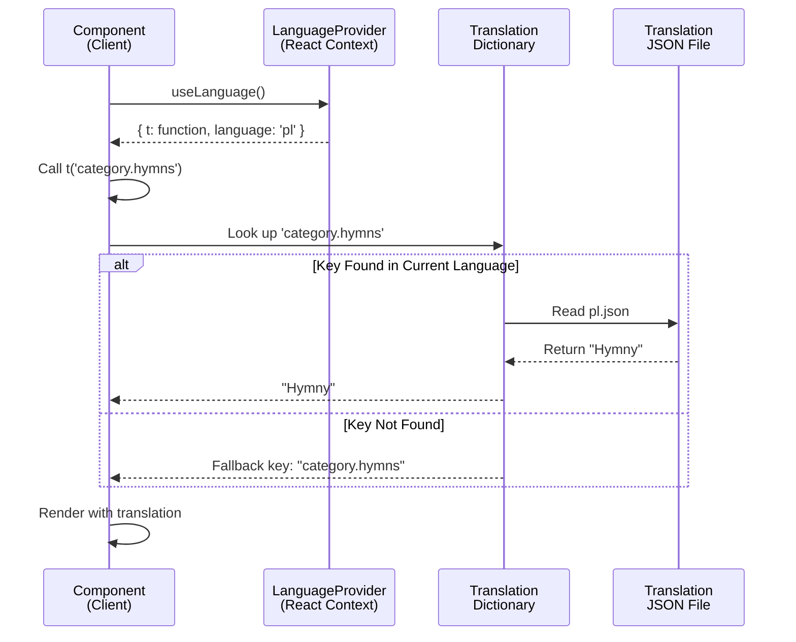
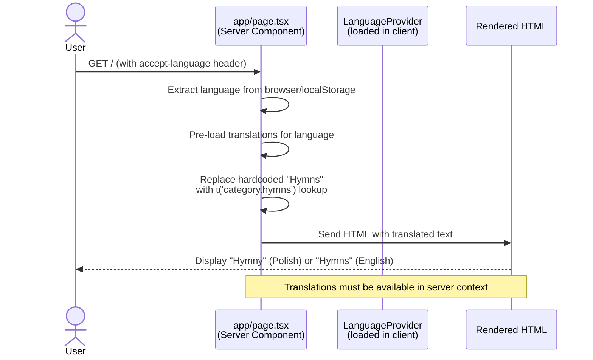
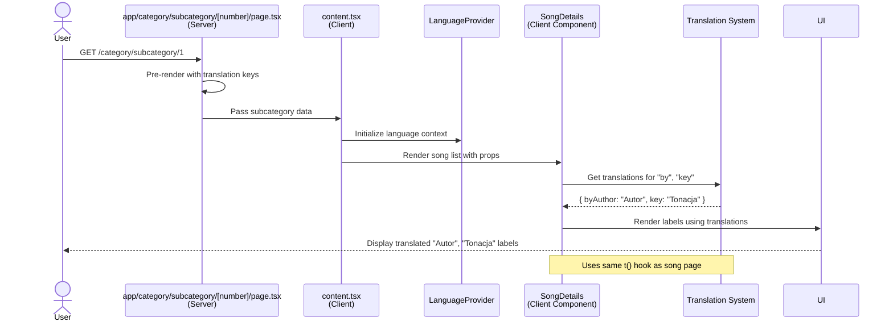
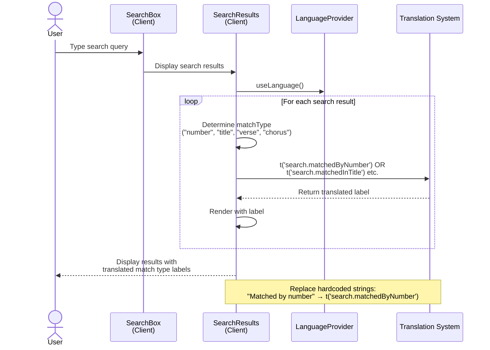
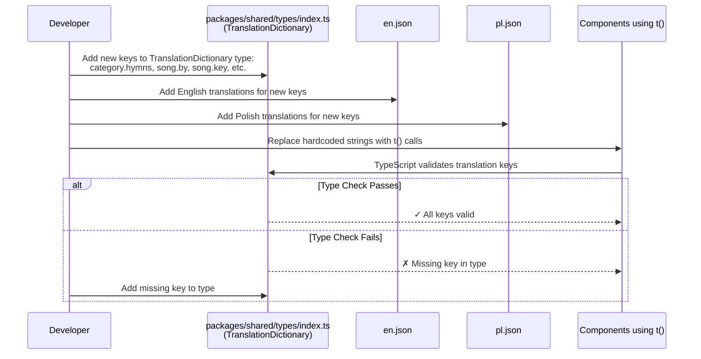

# Implementation Plan: Fix Missing Translations in UI

**Branch**: `004-fix-missing-translations` | **Date**: 2026-02-17 | **Spec**: [spec.md](spec.md)
**Input**: Feature specification from `/specs/004-fix-missing-translations/spec.md`

**Note**: This template is filled in by the `/speckit.plan` command. See `.specify/templates/commands/plan.md` for the execution workflow.

## Summary

Fix missing translations for specific UI text ("Hymns" on home page, "by" and "Key" on subcategory page) by ensuring all hardcoded English strings use the existing translation system. This addresses a critical user experience issue where non-English speakers encounter untranslated text in inconsistent locations while translations exist elsewhere in the application.

## Technical Context

**Language/Version**: TypeScript 5+ with strict mode
**Primary Dependencies**: React 19+, Next.js 16+ (App Router), pnpm 10+
**Storage**: Translation JSON files (`public/translations/en.json`, `public/translations/pl.json`)
**Testing**: Jest + React Testing Library
**Target Platform**: Web browser (Next.js)
**Project Type**: Web application (monorepo with pnpm workspaces)
**Performance Goals**: No new performance constraints; must maintain current page load times
**Constraints**: No additional constraints beyond existing Song Book standards
**Scale/Scope**: 2-3 files requiring translation key updates; 3 specific UI terms to translate

## Constitution Check

*GATE: Must pass before Phase 0 research. Re-check after Phase 1 design.*

✅ **Principle I (Type Safety First)**: Will use existing TypeScript types; no `any` types introduced
✅ **Principle II (Visual Documentation)**: Plan includes sequence diagrams for implementation flows
✅ **Principle III (Phased Development)**: Will commit after this plan phase, and after implementation tasks
✅ **Principle IV (Component Separation)**: Not applicable (bug fix, not new components); maintains existing separation
✅ **Principle V (Conventional Commits)**: Will use `fix(translations): ` prefix for commits
✅ **Principle VI (Root Cause Analysis)**: Root causes identified in spec - hardcoded strings vs translation keys
✅ **Principle VII (Pre-Commit Quality Gates)**: Implementation will pass `pnpm test && pnpm lint && pnpm coverage`

**GATE RESULT**: ✅ PASS - All principles compliant. No violations requiring justification.

## Project Structure

### Documentation (this feature)

```text
specs/[###-feature]/
├── plan.md              # This file (/speckit.plan command output)
├── research.md          # Phase 0 output (/speckit.plan command)
├── data-model.md        # Phase 1 output (/speckit.plan command)
├── quickstart.md        # Phase 1 output (/speckit.plan command)
├── contracts/           # Phase 1 output (/speckit.plan command)
└── tasks.md             # Phase 2 output (/speckit.tasks command - NOT created by /speckit.plan)
```

### Source Code (repository root)

```text
packages/web/
├── app/
│   ├── page.tsx                                    # Home page (includes "Hymns" text)
│   ├── category/
│   │   └── subcategory/
│   │       └── [number]/
│   │           ├── page.tsx                        # Subcategory page server component (contains hardcoded "by", "Key")
│   │           └── content.tsx                     # Subcategory page client component
│   └── song/
│       └── [number]/
│           ├── page.tsx                            # Song page server component
│           └── content.tsx                         # Song page client component (already uses translations)
├── components/
│   └── search/
│       └── search-results.tsx                      # Search results (match type labels hardcoded)
├── providers/
│   └── language-provider.tsx                       # Translation system (useLanguage hook)
├── public/
│   └── translations/
│       ├── en.json                                 # English translations
│       └── pl.json                                 # Polish translations
└── [tests for updated components]

packages/shared/
└── types/
    └── index.ts                                    # TranslationDictionary type definition
```

**Structure Decision**: Bug fix in existing monorepo structure. Changes affect:
- 3 source files with hardcoded strings (home page, subcategory page, search results)
- 1 translation type definition
- 2 translation JSON files (English and Polish)

## Detailed Sequence Diagrams *(mandatory)*

### Translation Key Resolution Flow (All Components)



### Home Page Translation Implementation



### Subcategory Page Translation Implementation



### Search Results Translation Implementation



### Type Definition Update Flow



## Implementation Approach

### Phase 1: Type Definition Updates

1. Update `packages/shared/types/index.ts` TranslationDictionary type with new keys:
   - `category.hymns` - "Hymns" for home page
   - `song.by` - "by" for subcategory/song pages
   - `song.key` - "Key" for subcategory/song pages
   - `search.matchedByNumber` - "Matched by number"
   - `search.matchedInTitle` - "Matched in title"
   - `search.matchedInVerses` - "Matched in verses"
   - `search.matchedInChorus` - "Matched in chorus"

2. Add translations to `packages/web/public/translations/en.json` and `pl.json` for all new keys

### Phase 2: Component Updates

1. **Home Page** (`packages/web/app/page.tsx`):
   - Replace hardcoded "Hymns" with translation key `category.hymns`
   - Ensure language context is available in server component

2. **Subcategory Page** (`packages/web/app/category/subcategory/[number]/page.tsx` and `content.tsx`):
   - Replace hardcoded "by" and "Key" with `song.by` and `song.key`
   - Use `useLanguage()` hook in client component to fetch translations

3. **Search Results** (`packages/web/components/search/search-results.tsx`):
   - Replace hardcoded match type labels with translation keys
   - Use consistent key naming: `search.matchedByNumber`, `search.matchedInTitle`, etc.

### Phase 3: Testing & Verification

- Verify all new translation keys are properly typed in TypeScript
- Test language switching with Polish language to confirm all translations display
- Verify consistency: "by" and "Key" display identically on subcategory and song pages
- Confirm no regression in existing functionality
