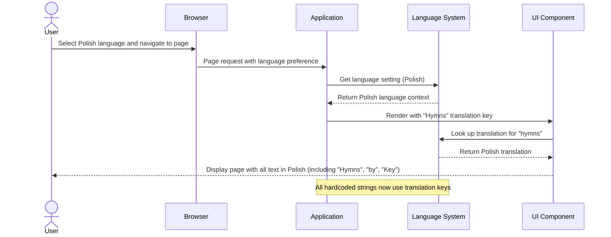
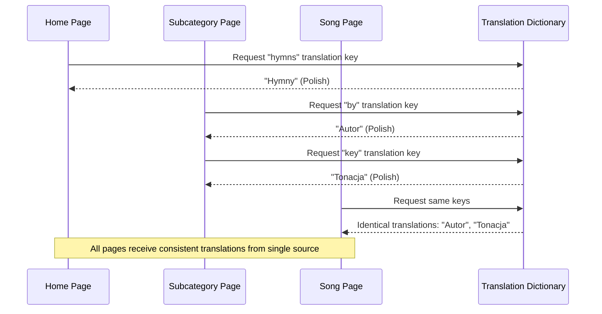

# Feature Specification: Fix Missing Translations in UI

**Feature Branch**: `004-fix-missing-translations`
**Created**: 2026-02-17
**Status**: Draft
**Input**: User description: "the word 'Hymns' is not translated on the home page. on the subcategory page 'by' and 'Key' are untranslated, but they are on the song page."

## Root Cause Analysis *(mandatory)*

### Problem Statement

Certain UI text that appears in multiple pages (song page, subcategory page, home page) is displayed in English on some pages but correctly translated on others. Users who prefer non-English languages encounter English text in inconsistent locations, creating a fragmented user experience. Specifically: "Hymns" on the home page, and "by" and "Key" labels on the subcategory page appear untranslated, though they are properly translated when displayed on the song page.

### Symptoms vs Root Causes

**Observed Symptoms**:
- The word "Hymns" displays in English on the home page regardless of selected language
- Labels "by" and "Key" display in English on the subcategory page
- The same terms are correctly translated on the song detail page
- Some error messages and UI labels remain in English on server-rendered pages
- Users switching to non-English languages still see some English text

**Root Cause Analysis**:

1. **Why do specific UI strings remain untranslated?**
   - These strings are hardcoded as English literals in component files instead of using translation keys

2. **Why are translations not used consistently across pages?**
   - Some pages and components use the `useLanguage()` hook to look up translations, while others have hardcoded strings
   - Server components (async page components) cannot use React Context hooks, so they resort to hardcoded text
   - Different developers may have added strings at different times without consistent translation patterns

3. **Why do the same terms have translations on the song page but not elsewhere?**
   - The song detail page component uses the translation system and properly references translation keys, but other pages were written before this became standard or don't have access to the translation context

**Identified Root Causes**:
- **RC-1**: Hardcoded English strings in components and pages instead of using translation keys - strings like "Hymns", "by", "Key" are literal values rather than lookup keys
- **RC-2**: Inconsistent translation usage across the application - some components use `t()` hook, others use hardcoded text
- **RC-3**: Server component limitations prevent React Context usage, requiring alternative approaches for translation that haven't been implemented

### Existing Solutions Analysis

| Solution/Approach | What It Addresses | Why It's Insufficient |
|-------------------|-------------------|----------------------|
| Manual hardcoding of translations in each language | Could translate some strings | Requires editing multiple files; doesn't solve root cause of inconsistency; not scalable as app grows |
| Using translation keys only in client components | Works for interactive components | Leaves server pages with untranslated text; inconsistent user experience |
| Storing translations in component files | Localizes translation definitions | Creates scattered translation data; makes it harder to manage translations centrally |

### Validated Assumptions

- **Assumption 1**: The application has an existing translation infrastructure (TranslationDictionary type, translation files for English and Polish, useLanguage hook)
  - Validation: Confirmed - language provider exists at `providers/language-provider.tsx`, translation files at `public/translations/en.json` and `pl.json`, TranslationDictionary type defined in `packages/shared/types/index.ts`
- **Assumption 2**: The same UI terms ("Hymns", "by", "Key") should display identically across all pages where they appear
  - Validation: Industry standard for consistent UX; confirmed by user report that these terms work correctly on song page
- **Assumption 3**: All visible UI strings should use the same translation system for consistency
  - Validation: Standard best practice; required for maintainability and user experience

### Solution Requirements

Based on the root cause analysis, solutions MUST:
- Address RC-1: Replace hardcoded English strings with translation key lookups using the existing translation system
- Address RC-2: Ensure all pages and components use consistent translation patterns via the translation system
- Address RC-3: Extend translation access to server components through mechanism that works with async server component constraints
- NOT just treat symptoms: Solution must establish consistent translation usage across all pages, not just patch individual strings

## User Scenarios & Testing *(mandatory)*

### User Story 1 - View Untranslated UI in Non-English Language (Priority: P1)

A user selects Polish as their language preference and navigates the application. All UI text they encounter - including "Hymns" on the home page, "by" and "Key" on the subcategory page - should display in Polish, providing a consistent translated experience across all pages.

**Why this priority**: This is the core issue - users cannot fully use the application in their preferred language because inconsistent UI text remains in English. Fixing this directly resolves the reported bug and is essential for accessibility.

**Independent Test**: Can be fully tested by selecting Polish language and navigating to home page and subcategory page to verify that all UI labels including "Hymns", "by", and "Key" are displayed in Polish (or appropriate non-English translation). Delivers immediate user value by making UI consistent.

**Acceptance Scenarios**:

1. **Given** the application is loaded and set to Polish language, **When** the user navigates to the home page, **Then** the word "Hymns" appears in Polish translation, not English
2. **Given** the application is set to Polish language, **When** the user navigates to a subcategory page, **Then** the label "by" appears in Polish translation
3. **Given** the application is set to Polish language, **When** the user views a subcategory page, **Then** the label "Key" appears in Polish translation
4. **Given** the same page is loaded in English and Polish, **When** comparing the subcategory page, **Then** "by" and "Key" display identically to how they appear on the song page in both languages
5. **Given** a user switches from English to Polish language, **When** the language changes, **Then** all previously-hardcoded strings (Hymns, by, Key) update to Polish without page reload issues

---

### User Story 2 - Ensure Consistent Translation Terminology Across Pages (Priority: P1)

When the same word or phrase appears on multiple pages (song page, subcategory page, home page), it must use the same translation key and display the same translated text. Users should see consistent terminology regardless of which page they're on.

**Why this priority**: Consistency prevents confusion and improves user confidence in the application. Combined with Story 1, this achieves the goal of complete translation coverage and consistency.

**Independent Test**: Can be fully tested by viewing the same UI term in multiple locations (e.g., "Key" on song page vs subcategory page, "by" in different contexts) in both English and non-English languages, verifying identical text appears everywhere. Delivers value of professional, consistent UX.

**Acceptance Scenarios**:

1. **Given** the term "Key" appears on both song page and subcategory page, **When** viewing both pages in Polish, **Then** the translation is identical
2. **Given** a user searches for a song and reviews results, **When** comparing labels on search results with corresponding song page, **Then** matching term translations are identical
3. **Given** the application supports multiple languages (English, Polish), **When** comparing any page with the same UI terms, **Then** translation consistency is maintained across all supported languages

---

### Edge Cases

- What happens when a new user-facing string is added to the codebase after this fix? → Developer documentation should clarify that all UI strings must use translation keys, not hardcoded text
- How are dynamic values handled (e.g., song number in error messages)? → Translation keys should support templating via existing `replace()` pattern (e.g., `t('song.invalidNumber').replace('{number}', songNumber)`)
- What if a translation file is incomplete or missing for a newly added key? → System should fall back to the key itself as a visible indicator that translation is missing, or fall back to English
- How should error messages in server components access translations? → Translation data must be accessible in server context, either pre-loaded or via alternative mechanism that doesn't rely on React Context

## High-Level Sequence Diagrams *(mandatory)*

### User Story 1 Flow: Language-Aware Page Rendering

### User Story 2 Flow: Consistent Translation Across Pages

## Requirements *(mandatory)*

### Functional Requirements

- **FR-001**: All visible UI text must use the translation system (translation keys) instead of hardcoded English strings
- **FR-002**: Specifically, the following strings must be moved to translation keys: "Hymns" (home page), "by" (subcategory page), "Key" (subcategory page)
- **FR-003**: Translation keys for these strings must map to existing translations if they already exist elsewhere, or new translations must be added to both English and Polish translation files
- **FR-004**: When a user selects a non-English language, all UI text including previously hardcoded strings must update to display in the selected language
- **FR-005**: The same translation key must be used consistently across all pages and components where identical terms appear
- **FR-006**: Error messages and validation feedback that are currently hardcoded must use translation keys
- **FR-007**: Server-rendered pages must have access to translations to support proper rendering in the user's selected language

### Key Entities

- **TranslationDictionary**: Centralized mapping of translation keys to translated strings for each supported language (English, Polish)
- **Translation Key**: A dot-notation identifier (e.g., "category.hymns", "song.byAuthor", "song.key") that maps to a specific translation
- **User Language Preference**: User's selected language that determines which translation file is loaded and used for rendering

## Success Criteria *(mandatory)*

### Measurable Outcomes

- **SC-001**: 100% of user-visible UI text displays in the user's selected language (English, Polish, or others) without any English hardcoded strings remaining visible
- **SC-002**: The words "Hymns", "by", and "Key" are translated consistently across all pages (home page, subcategory page, song page) when viewed in non-English languages
- **SC-003**: All error messages and validation feedback are translatable and display in the user's selected language
- **SC-004**: When language is changed, all previously untranslated strings update to the new language within the page load time
- **SC-005**: Any new UI text added after this fix uses translation keys, as documented in developer guidelines
- **SC-006**: Translation consistency achieved: identical terms appear with identical translations across all pages and components
