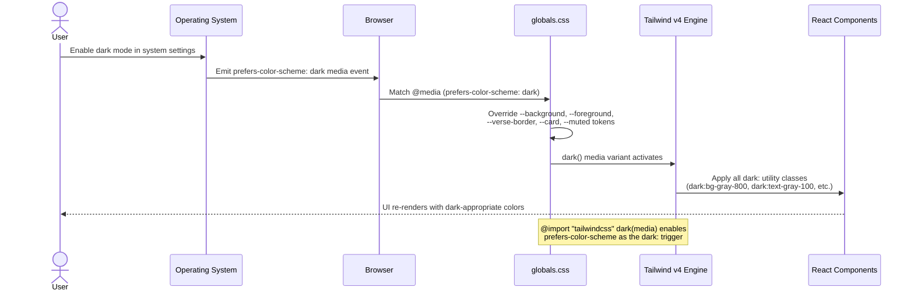
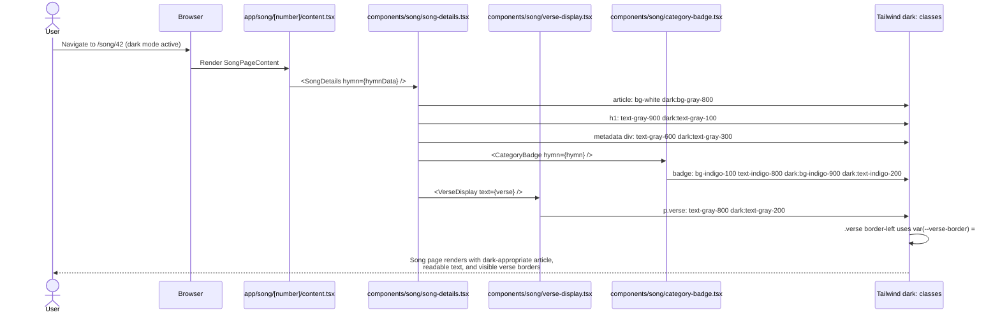
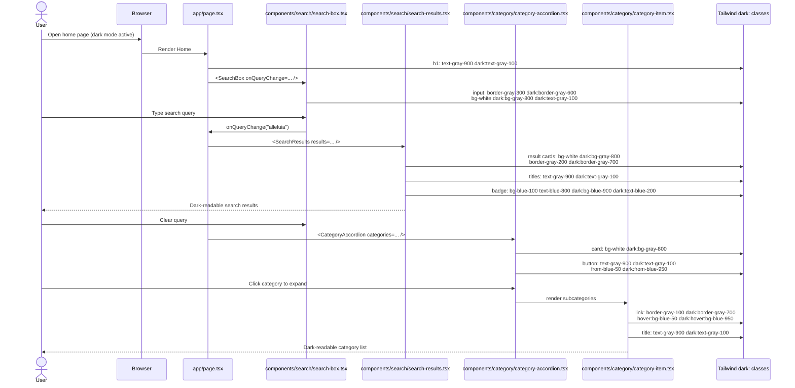
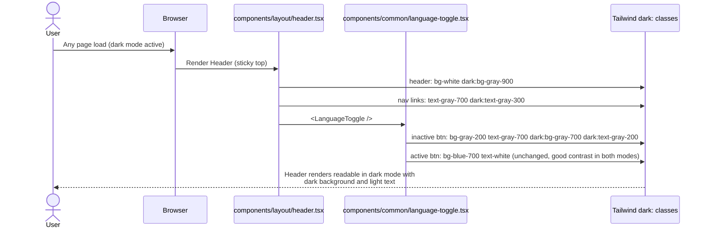

# Implementation Plan: Fix Text Readability in Night Mode

**Branch**: `005-fix-night-mode` | **Date**: 2026-03-19 | **Spec**: [spec.md](./spec.md)
**Input**: Feature specification from `/specs/005-fix-night-mode/spec.md`

## Summary

The song book app displays unreadable text in dark/night mode because all UI components use hardcoded light-mode Tailwind CSS color classes (`bg-white`, `text-gray-900`, `border-gray-200`, etc.) that ignore `prefers-color-scheme: dark`. The fix is purely additive: activate Tailwind v4's media-based dark mode, extend CSS custom property tokens, and add `dark:` variant classes to every affected component and page.

No API endpoints, data models, or new dependencies are required. The change spans 13 files (1 global CSS file + 12 component/page TSX files).

## Technical Context

**Language/Version**: TypeScript 5.3+ (strict mode enabled)
**Primary Dependencies**: React 19, Next.js 16 (App Router), Tailwind CSS 4.0, pnpm 10+
**Storage**: N/A (no data persistence involved in this feature)
**Testing**: Jest 29 + React Testing Library (jsdom), pnpm test/lint/coverage
**Target Platform**: Web (Next.js SSR + client components, PWA-capable)
**Project Type**: Web application (Next.js monorepo — `packages/web`)
**Performance Goals**: No performance impact expected — CSS changes only
**Constraints**: Must not regress light mode. Must maintain 100% test coverage. No new dependencies.
**Scale/Scope**: 13 files modified; affects every visible UI component across all pages

## Constitution Check

*GATE: Must pass before Phase 0 research. Re-check after Phase 1 design.*

| Principle | Status | Notes |
|-----------|--------|-------|
| I. Type Safety First | ✅ PASS | No TypeScript changes; all existing types remain. No `any` introduced. |
| II. Visual Documentation | ✅ PASS | Detailed sequence diagrams included below. |
| III. Phased Development | ✅ PASS | Commits after spec, plan, tasks, and each implementation phase. |
| IV. Component Separation | ✅ PASS | Changes are additive CSS classes only. Component logic/props unchanged. |
| V. Conventional Commits | ✅ PASS | All commits follow `fix(styles):` or `fix(components):` format. |
| VI. Root Cause Analysis | ✅ PASS | Root cause fully documented in spec.md and research.md. |
| VII. Pre-Commit Quality Gates | ✅ PASS | pnpm test && pnpm lint && pnpm coverage must pass before each commit. |

**Post-Design Re-check**: All gates remain green. No violations introduced by the design.

## Project Structure

### Documentation (this feature)

```text
specs/005-fix-night-mode/
├── spec.md                          # Feature specification
├── plan.md                          # This file
├── research.md                      # Phase 0: dark mode mechanism & color mapping
├── checklists/
│   └── requirements.md              # Spec quality checklist
└── tasks.md                         # Phase 2 output (/speckit.tasks command)
```

### Source Code (affected files)

```text
packages/web/
├── app/
│   ├── globals.css                                        # Dark mode activation + new CSS tokens
│   ├── page.tsx                                           # Hero title, subtitle, category heading
│   ├── song/[number]/
│   │   └── content.tsx                                    # Loading/error/not-found states + back button
│   └── category/subcategory/[number]/
│       └── content.tsx                                    # Breadcrumb, heading, back button
└── components/
    ├── layout/
    │   └── header.tsx                                     # Header background + nav link colors
    ├── category/
    │   ├── category-accordion.tsx                         # Card bg, button gradient, border
    │   └── category-item.tsx                              # Border, hover, title, count, arrow
    ├── song/
    │   ├── song-card.tsx                                  # Card bg, border, all text colors
    │   ├── song-details.tsx                               # Article bg, title, metadata, chorus
    │   ├── verse-display.tsx                              # Verse text color
    │   └── category-badge.tsx                             # Badge bg + text
    ├── search/
    │   ├── search-box.tsx                                 # Input bg, border, icon, clear button
    │   └── search-results.tsx                             # Cards, text, badge colors
    └── common/
        └── language-toggle.tsx                            # Inactive button colors
```

**Structure Decision**: Existing Next.js App Router structure with `packages/web` monorepo package. No new files or directories needed. All changes are within existing files.

## Detailed Sequence Diagrams *(mandatory)*

### Dark Mode Activation Flow (System Level)



### Song Detail Page - Dark Mode Rendering (User Story 1)



### Home Page - Search + Categories Flow (User Story 2 + 3)



### Header + Navigation Dark Mode



## Complexity Tracking

No constitution violations. No complexity to justify.

## Implementation Notes

### Tailwind v4 Dark Mode Activation

The single most important change is in `globals.css`. Line 1 must change from:
```css
@import "tailwindcss";
```
to:
```css
@import "tailwindcss" dark(media);
```

This activates `@media (prefers-color-scheme: dark)` as the trigger for all `dark:` Tailwind utility classes. Without this, the `dark:` classes compile but do not activate on system dark mode.

### CSS Custom Properties Extension

Add to the `:root` block (light) and `@media (prefers-color-scheme: dark)` block (dark):

```css
:root {
  --background: #ffffff;
  --foreground: #171717;
  --verse-border: #d1d5db;  /* gray-300 */
}

@media (prefers-color-scheme: dark) {
  :root {
    --background: #0a0a0a;
    --foreground: #ededed;
    --verse-border: #4b5563;  /* gray-600 */
  }
}
```

The `.verse` CSS class border changes from `border-left: 2px solid #ccc` to `border-left: 2px solid var(--verse-border)`.

### Testing Approach

All component tests use React Testing Library with Jest/jsdom. The `dark:` classes are compiled into the className strings of rendered elements. Tests should:
1. Verify dark mode classes are present in `className` attributes (snapshot or explicit assertion)
2. Existing functional tests (click handlers, prop rendering) are unaffected

Existing tests already achieve 100% coverage. After adding `dark:` classes, re-run `pnpm test && pnpm lint && pnpm coverage` to confirm nothing regressed.
