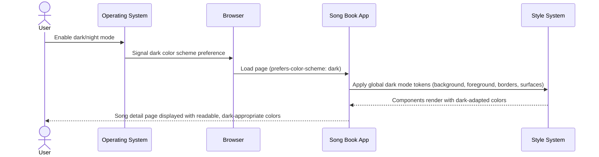
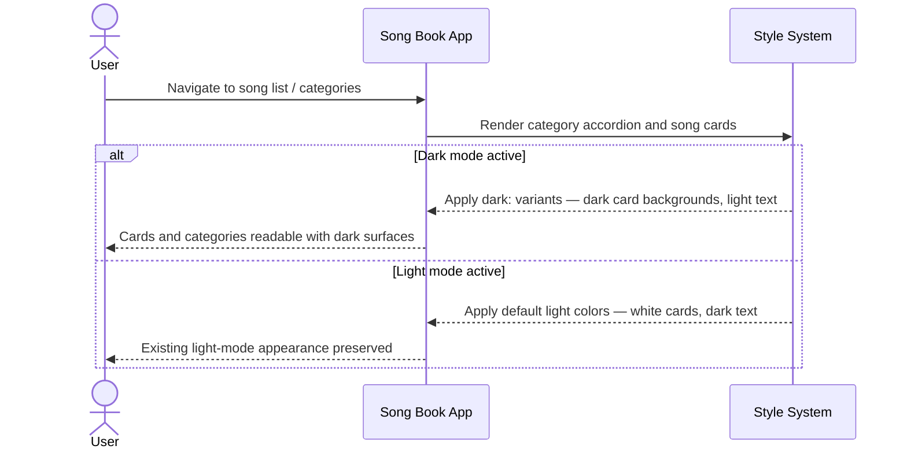

# Feature Specification: Fix Text Readability in Night Mode

**Feature Branch**: `005-fix-night-mode`
**Created**: 2026-03-19
**Status**: Draft
**Input**: User description: "the text looks bad in night mode"

## Root Cause Analysis *(mandatory)*

### Problem Statement

When users have their device or browser set to dark/night mode (system-level dark preference), the song book application displays text that is difficult or impossible to read. Certain UI elements appear with improper contrast — for example, dark text on dark backgrounds, or hard-coded light-colored backgrounds that make text illegible.

### Symptoms vs Root Causes

**Observed Symptoms**:
- Text appears too dark or nearly invisible against dark backgrounds in night mode
- Card elements (song cards, category items, search results) show white backgrounds in dark mode, creating harsh contrast and visual noise
- Verse text displayed with a hardcoded border color that does not adapt to dark mode
- Input fields and buttons retain light-mode colors, making them hard to distinguish from backgrounds

**Root Cause Analysis**:

1. **Why does text appear unreadable in night mode?**
   - UI components use hardcoded, non-adaptive color classes (e.g., `bg-white`, `text-gray-900`, `border-gray-200`) that do not respond to the user's system color scheme preference.

2. **Why are hardcoded colors used instead of adaptive ones?**
   - Components were styled without considering dark mode, relying on specific Tailwind color utilities rather than semantic or dark-mode-aware variants.

3. **Why do the semantic CSS variables not help?**
   - The global CSS defines `--background` and `--foreground` variables that adapt to dark mode, but most components bypass these variables and use hardcoded Tailwind classes directly.

**Identified Root Causes**:
- **RC-1**: Component color classes are hardcoded to light-mode values and do not use Tailwind's `dark:` variant prefix or semantic CSS variables, leaving them unchanged when the user's system preference is dark.
- **RC-2**: The global CSS does not propagate adaptive color tokens (such as border, card surface, muted text) beyond the base background and foreground, so there are no consistent dark-mode tokens for components to use.

### Existing Solutions Analysis

| Solution/Approach | What It Addresses | Why It's Insufficient |
|-------------------|-------------------|-----------------------|
| `prefers-color-scheme` media query in globals.css | Adapts base background and foreground | Only covers two variables; all component-level colors remain hardcoded |
| Manual `dark:` class on each element | Would fix individual elements | Not yet applied; needs systematic coverage across all components |
| Browser reader mode | Provides readable text | External workaround; not a product solution; loses app styling entirely |

### Validated Assumptions

- **Assumption 1**: The application is intended to be used in both light and dark environments (e.g., during evening worship services where night mode is preferred).
  - Validation: NEEDS VALIDATION — reasonable assumption given the nature of a song book app used in varied lighting conditions.
- **Assumption 2**: The Tailwind CSS configuration supports dark mode via `prefers-color-scheme` (the default "media" strategy).
  - Validation: Confirmed — `globals.css` already contains a `prefers-color-scheme: dark` media query, indicating dark mode is already partially implemented.
- **Assumption 3**: All relevant components have hardcoded light-mode color classes.
  - Validation: Confirmed — code review shows extensive use of `bg-white`, `text-gray-900`, `text-gray-500`, `border-gray-200`, `border-gray-100`, `text-gray-800`, etc. across category, song, search, and layout components.

### Solution Requirements

Based on the root cause analysis, solutions MUST:
- Address root cause RC-1: Replace or augment hardcoded light-mode color classes with dark-mode-aware alternatives (Tailwind `dark:` variants or semantic CSS custom properties) across all UI components.
- Address root cause RC-2: Extend the global CSS color token system to include adaptive tokens for card surfaces, borders, muted text, and input fields — not just background and foreground — so components have a consistent palette to use.
- NOT just treat symptoms: The fix must be systematic, not limited to a single component. Adding a single `dark:` class to one element would not solve the underlying problem of incomplete dark mode support.

## User Scenarios & Testing *(mandatory)*

### User Story 1 - Readable Song Content in Night Mode (Priority: P1)

A user attending an evening worship service has their phone set to dark/night mode. They open the song book, navigate to a song, and want to read lyrics comfortably without eye strain or poor contrast.

**Why this priority**: Song lyrics are the core content of the app. Readability of verse text and song details in dark mode is the highest-value outcome of this fix.

**Independent Test**: Navigate to any song detail page on a device with dark mode enabled; all text (title, author, verse content, chorus labels) must be clearly legible with sufficient contrast.

**Acceptance Scenarios**:

1. **Given** a device with system dark mode enabled, **When** the user opens a song detail page, **Then** all song text (title, verses, chorus, author, key) is clearly readable with adequate contrast against the background.
2. **Given** a device with system dark mode enabled, **When** a verse is displayed, **Then** the verse border accent and surrounding card surface use colors appropriate for a dark background.
3. **Given** a device with system light mode enabled, **When** the user opens a song detail page, **Then** the existing light-mode appearance is fully preserved and unchanged.

---

### User Story 2 - Browsable Song List in Night Mode (Priority: P2)

A user browsing the song list or category accordion in dark mode can clearly distinguish song cards, category headings, and interactive items without white-box glare or invisible text.

**Why this priority**: Song discovery and navigation are the second most critical user activity. Glaring white cards in dark mode create significant visual discomfort.

**Independent Test**: Scroll the song list and expand category accordions on a dark-mode device; every card, category header, and list item must render with appropriate dark-mode colors.

**Acceptance Scenarios**:

1. **Given** dark mode is active, **When** the user views the category accordion, **Then** category headers and song list items display with dark-appropriate background colors, and text is readable.
2. **Given** dark mode is active, **When** a song card is shown, **Then** the card background is dark-appropriate (not white), and all text within the card is legible.
3. **Given** dark mode is active, **When** the user hovers or focuses a song card or category item, **Then** hover/focus visual feedback remains visible and does not disappear into the background.

---

### User Story 3 - Usable Search Experience in Night Mode (Priority: P3)

A user searching for a song in dark mode can see and use the search input, read search results, and distinguish result items from the surrounding background.

**Why this priority**: Search is an important navigation path, but it is less used than direct browsing; hence lower priority.

**Independent Test**: Open the search panel on a dark-mode device, type a query, and review results; the input field, placeholder, results list, and result cards must all be legible.

**Acceptance Scenarios**:

1. **Given** dark mode is active, **When** the user focuses the search input, **Then** the input field, border, and placeholder text are visible against the dark background.
2. **Given** dark mode is active and a search returns results, **When** the results are displayed, **Then** each result card, title text, and metadata are clearly readable.
3. **Given** dark mode is active and a search returns no results, **Then** the "no results" message is readable.

---

### Edge Cases

- What happens when the user switches system theme (light ↔ dark) while the app is open? The app should respond to the change immediately without requiring a page reload.
- What happens with elements that use gradient backgrounds (e.g., category headers with blue gradients)? These should be reviewed to ensure text remains legible in dark mode and the gradient either adapts or remains intentionally branded.
- What happens on browsers that do not support `prefers-color-scheme`? The app should fall back gracefully to light mode colors (the current default behavior).

## High-Level Sequence Diagrams *(mandatory)*

### User Story 1 Flow

### User Story 2 Flow

## Requirements *(mandatory)*

### Functional Requirements

- **FR-001**: All text elements across the application MUST have sufficient color contrast in both light and dark modes, meeting at least WCAG AA contrast ratios (4.5:1 for normal text, 3:1 for large text).
- **FR-002**: Card and container surface colors (song cards, category accordions, search result items) MUST adapt to dark mode and NOT display white or light-colored backgrounds when the user's system is in dark mode.
- **FR-003**: Border colors used for dividers, card outlines, and verse accent lines MUST adapt to dark mode and remain visible but not overpowering.
- **FR-004**: Interactive elements (search input, buttons, hover states) MUST remain visually distinguishable in dark mode.
- **FR-005**: The application MUST respond to system-level dark/light mode changes without requiring a page reload.
- **FR-006**: Light mode appearance MUST remain unchanged — the fix must be additive, not replacing existing light-mode styles.
- **FR-007**: The verse display border accent (`border-left` styling) MUST adapt to a dark-mode-appropriate color so verses remain visually structured in dark mode.

## Success Criteria *(mandatory)*

### Measurable Outcomes

- **SC-001**: All text in the application achieves at minimum WCAG AA contrast ratio (4.5:1 for body text) when measured in dark mode — verifiable via automated accessibility tooling or manual contrast check.
- **SC-002**: Zero UI components retain a white or near-white (`#ffffff` or equivalent) background color when the device is in dark mode.
- **SC-003**: The dark mode appearance is consistent across all major views: song list, category browser, song detail page, and search — with no individual component remaining unstyled for dark mode.
- **SC-004**: A user can switch system theme from light to dark (or vice versa) and the app updates immediately without any page reload required.
- **SC-005**: No regression in light mode — all existing light-mode visual tests and manual checks continue to pass after the fix.
